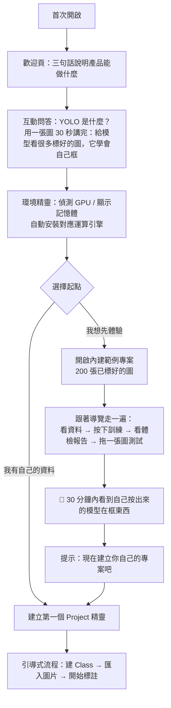
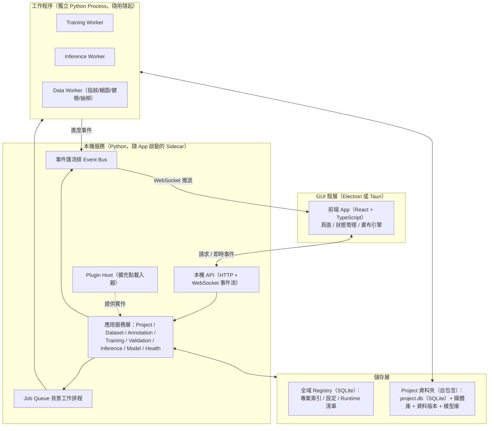
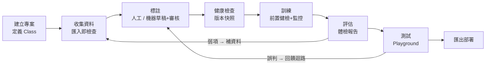
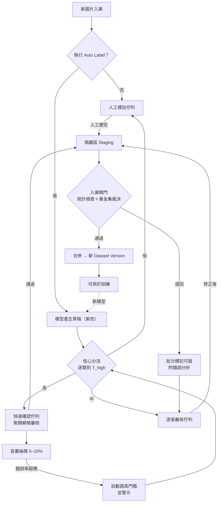
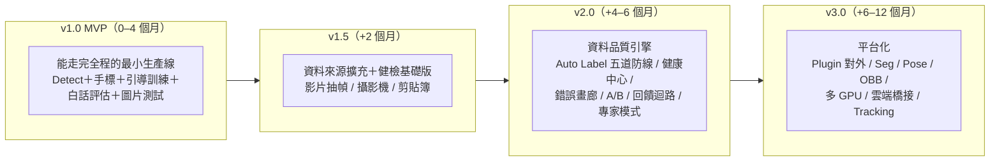

# GoodYolo — Universal YOLO Workbench 產品規劃書

> **🟧 文件狀態：部分失效（R1 歷史規劃）** — 本文件中 10 項設計已被《VisionForge Constitution v1.0》附錄「違憲審查」推翻或修正（YOLO 身分、手標優先、封閉 Class、終點＝匯出等）。治理五防線、審核 UX、白話層、工程地基、部署一致性驗證等章節仍為有效素材，R3 起草時沿用。**效力以憲法為準，本文件僅供參考，不得作為開發依據。**

| 項目 | 內容 |
|---|---|
| 文件版本 | v1.0（草案） |
| 日期 | 2026-07-07 |
| 性質 | 產品規劃 / 高層架構設計（不含實作程式碼與資料庫 Schema） |
| 目標讀者 | 產品擁有者、未來的開發者（可能是同一人） |

---

## 目錄

- [第 0 章　設計哲學（總綱）](#第-0-章設計哲學總綱)
- [第 1 章　產品定位](#第-1-章產品定位)
- [第 2 章　使用者旅程（User Journey）](#第-2-章使用者旅程user-journey)
- [第 3 章　功能地圖（Function Map）](#第-3-章功能地圖function-map)
- [第 4 章　GUI 架構](#第-4-章gui-架構)
- [第 5 章　模組架構（技術高層設計）](#第-5-章模組架構技術高層設計)
- [第 6 章　核心工作流程](#第-6-章核心工作流程)
- [第 7 章　Dataset 流程與健康管理系統](#第-7-章dataset-流程與健康管理系統)
- [第 8 章　Annotation 流程](#第-8-章annotation-流程)
- [第 9 章　Auto Label 改善方案](#第-9-章auto-label-改善方案)
- [第 10 章　Training 流程](#第-10-章training-流程)
- [第 11 章　Validation 流程](#第-11-章validation-流程)
- [第 12 章　Testing 流程（Inference Playground）](#第-12-章testing-流程inference-playground)
- [第 13 章　Model 管理](#第-13-章model-管理)
- [第 14 章　Plugin System](#第-14-章plugin-system)
- [第 15 章　未來 Roadmap](#第-15-章未來-roadmap)
- [第 16 章　MVP（v1.0）](#第-16-章mvpv10)
- [第 17 章　第二版（v2.0）](#第-17-章第二版v20)
- [第 18 章　第三版（v3.0）](#第-18-章第三版v30)
- [第 19 章　風險分析](#第-19-章風險分析)
- [第 20 章　優先投入建議](#第-20-章優先投入建議)
- [附錄 A　新手術語白話對照表](#附錄-a新手術語白話對照表)
- [附錄 B　Project 資料夾結構草案](#附錄-bproject-資料夾結構草案)
- [附錄 C　需求覆蓋對照表](#附錄-c需求覆蓋對照表)

---

# 第 0 章　設計哲學（總綱）

在進入任何功能之前，先確立三條貫穿整個產品的原則。後續每一章的設計決策，都能回溯到這三條。

**原則一：新手能獨自走完全程。**
不是「有文件可查」，而是產品本身就是老師。每一個畫面都回答三個問題：我在哪裡？我現在該做什麼？做完之後會發生什麼？只要使用者迷路一次，就是產品的失敗，不是使用者的失敗。北極星指標：**TTFS（Time To First Success）**——一位零基礎使用者，從安裝到「親眼看到自己的模型框出目標」所需的時間。目標：用內建範例專案 30 分鐘內、用自己的資料 1 天內。

**原則二：資料品質是唯一的核心資產。**
模型會過時、引擎會換代、參數可以重調，但一份血統乾淨、版本清楚、健康度高的資料集可以用十年。因此本產品把「資料的可信度」當作第一公民：每一筆標註都有出處（血統）、每一次入庫都有關卡（閘門）、每一版資料都可回滾（版本化）。Auto Label 永遠只產生「草稿」，從不直接產生「資料」。

**原則三：一切皆模組，今天的內建功能就是明天的 Plugin。**
任務類型（Detect / Segment / Pose / OBB）、推論引擎（Ultralytics / RT-DETR / …）、資料來源（圖片 / 影片 / 攝影機 / PDF / 螢幕）、匯出格式、健康檢查規則——全部定義成擴充點。第一版不對外開放 Plugin API，但內部模組從第一天就以 Plugin 介面實作（自己吃自己的狗糧），確保架構不會在 v3 才發現要重寫。

一句話總結產品：

> **GoodYolo 是一座「帶著老師的視覺模型工廠」——新手照著走就能產出可用的模型，專家能把它擴充成自己的研究平台，而資料品質機制保證它越用越準、而不是越用越歪。**

---

# 第 1 章　產品定位

## 1.1 願景

一套可以使用很多年的通用桌面視覺模型工作台。今天訓練工程圖符號、CAD 截圖、遊戲畫面、UI 元件、人物、動物、工業零件、瑕疵；明天擴充到 Segmentation、Pose、OBB、Tracking、多模型比較、多 GPU、雲端訓練。專案會換、題目會換，工具不用換。

## 1.2 目標使用者（三層）

| 層級 | 描述 | 產品對他的意義 |
|---|---|---|
| L1 完全新手 | 沒聽過 Dataset / Epoch / mAP，有一個想解決的視覺問題（例如「幫我抓出圖上的螺絲」） | 一步一步被引導，不需要外部教學就能產出第一個模型 |
| L2 進階使用者 | 用過幾次之後開始理解概念，想調參數、比較模型、管理多個專案 | 專家模式解鎖全部參數與批次操作，但保留所有安全網 |
| L3 開發者（未來） | 想接新引擎、新任務類型、新資料來源 | Plugin API 與清楚的擴充點 |

同一位使用者會從 L1 成長到 L2——**產品必須陪著使用者長大**，這是「新手模式 / 專家模式」雙模式設計的根本理由（詳第 4 章）。

## 1.3 與現有工具的差異

| 面向 | LabelImg / X-AnyLabeling | CVAT / Label Studio | Roboflow（雲端） | 自己跑 CLI + 腳本 | **GoodYolo** |
|---|---|---|---|---|---|
| 定位 | 標註工具 | 標註平台 | 全流程雲服務 | 工程師工作流 | **本機全流程工作台** |
| 新手引導 | 無 | 弱 | 中 | 無 | **核心賣點** |
| 訓練 | 無 | 無／外掛 | 有（雲端計費） | 有 | **有（本機、白話化）** |
| 評估解讀 | 無 | 無 | 數字為主 | 自己看曲線 | **白話體檢報告** |
| Auto Label 防呆 | 無（直接吐框） | 弱 | 弱 | 無 | **五道防線（第 9 章）** |
| 資料版本 / 血統 | 無 | 部分 | 有版本 | 自己管資料夾 | **內建、預設開啟** |
| 資料主權 | 本機 | 自架 | **在別人雲上** | 本機 | **完全本機** |
| 長期通用性 | 單一用途 | 標註為主 | 綁平台 | 高但費工 | **模組化平台** |

定位縫隙很清楚：**「本機、全流程、新手可獨立完成、資料品質內建」四者兼備的桌面產品，目前市場上沒有。**

## 1.4 非目標（明確不做的事）

刻意不做的事和要做的事一樣重要：

1. **不做雲端 SaaS**。資料留在使用者電腦，v3 之後才考慮「橋接」雲端算力（訓練外包出去、資料仍由使用者掌控）。
2. **不做通用 ML 平台**。不碰表格資料、NLP、語音。專注視覺、專注偵測系任務。
3. **不自研模型架構**。站在 Ultralytics 等成熟引擎肩膀上，價值放在工作流與資料品質。
4. **v1 不做多人協作**。先把單人體驗做到極致；協作是 v3 的選配題。
5. **不做「什麼都能調」的工程師面板**。專家模式開放參數，但預設永遠是「有主見的預設值」。

---

# 第 2 章　使用者旅程（User Journey）

## 2.1 人物誌

**小美（L1 新手）**：電子廠品管工程師，Excel 很熟、不會寫程式。主管說「聽說 AI 可以自動抓 PCB 焊點瑕疵，你研究一下」。她 Google 到的教學全是命令列，第一步裝 CUDA 就卡住。她需要的不是功能，是**信心**。

**阿宏（L2 進階）**：機構設計師兼遊戲玩家。想從工程圖抓標準件符號，也想做遊戲畫面的目標偵測。他已經懂基本概念，痛點是**每個專案都要重搭一次環境、資料散落各處、模型檔案命名成 best(3)_final_v2.pt**。

## 2.2 首次啟動旅程（The First Run）

第一次開啟是整個產品最重要的 15 分鐘。流程設計如下：



三個關鍵設計決策：

**（a）內建範例專案是第一優先功能。** 新手最大的心理障礙是「我還沒有資料、我不確定會不會成功」。範例專案（例如：200 張已標註的螺絲/螺帽圖）讓使用者**零成本走完全程**——按下訓練、看著曲線動、拖圖進去看到框——先建立「這件事我做得到」的信心，再回頭處理自己的資料。這是把 TTFS 壓到 30 分鐘的手段。

**（b）環境精靈把 CUDA 地獄藏起來。** 首次啟動自動偵測顯卡→下載對應的運算 Runtime（NVIDIA CUDA / CPU / DirectML），顯示進度與預估時間，失敗時自動降級到 CPU 並白話說明「訓練會比較慢，但一切功能可用」。使用者從頭到尾不需要知道 PyTorch 是什麼。

**（c）概念教學「隨用隨教」，不是前置課程。** 歡迎頁只講 30 秒的大圖景。Epoch 是什麼？等使用者第一次走到訓練頁再教。教學出現在**需要它的當下**，才會被吸收（詳 2.4 導引系統）。

## 2.3 三十天旅程

| 階段 | 使用者在做什麼 | 產品必須提供什麼 | 最可能放棄的原因 → 對策 |
|---|---|---|---|
| Day 0 | 下載安裝 | 單一安裝檔、環境精靈 | 安裝失敗 → CPU 降級保底、清楚的錯誤說明 |
| Day 1 | 範例專案走完全程 | 導覽模式、範例資料 | 「不知道下一步」→ 下一步引擎（2.4） |
| Day 2–7 | 建自己的專案、收圖、標註 | 匯入管線、標註中心、健康提示 | 標註太累 → 效率快捷鍵、進度感（「已標 80/300」） |
| Day 7–14 | 第一次用自己的資料訓練 | 訓練前健檢、白話監控 | 結果很爛而不知道為什麼 → 體檢報告 + 建議引擎指出「哪個類別缺圖」 |
| Day 14–30 | 迭代：加資料 → 重訓 → 比較 | 版本管理、模型比較、Auto Label 輔助 | 越訓越差 → 血統與閘門機制保護（第 9 章） |
| Day 30+ | 部署使用、開新題目 | 匯出中心、部署包、多專案管理 | 部署後跑不起來 → 部署包含前後處理參數與範例 |

## 2.4 導引系統（四層設計）

導引不是一個功能，是一個系統。四層由淺入深：

**第一層：下一步引擎（Next-Step Engine）。** 首頁與每個專案頁的頂部永遠顯示一張「下一步卡片」：根據專案狀態機（第 6 章）推導出當前最該做的一件事，例如「你有 120 張圖還沒標註 → [繼續標註]」「訓練完成 → [查看體檢報告]」。新手永遠不需要自己想流程。

**第二層：情境提示（Contextual Coaching）。** 在動作發生的當下給知識。第一次按訓練 → 彈出 60 秒圖解「訓練是什麼、你會看到什麼」；第一次看到 mAP → 名詞自動帶虛線底線，滑鼠移過顯示白話解釋（附錄 A 的術語表全文內建成 hover 字典）。每則提示可勾選「我懂了，不再顯示」。

**第三層：互動教學（Interactive Tutorial）。** 範例專案配套的導覽模式：高亮該點的按鈕、遮罩其他區域、一步一步帶操作。只在使用者主動選「帶我走一遍」時啟動，絕不強制。

**第四層：學習中心（Learning Center）。** 內建的 5 分鐘概念卡片集：「資料越多越好嗎？」「為什麼要分驗證集？」「過擬合是什麼感覺？」。特點是**從產品內的真實情境連過去**——體檢報告說「疑似過擬合」時，旁邊就是「什麼是過擬合？」的卡片入口。學習中心是被查閱的，不是被閱讀的。

## 2.5 情緒曲線與防流失

新手旅程有三個情緒低谷，每個低谷都要有明確的產品對策：

1. **「裝不起來」（Day 0）**：環境精靈 + CPU 保底 + 失敗時的人話錯誤訊息（「你的顯卡驅動太舊，點此更新」而非 stack trace）。
2. **「標註好無聊」（Day 2–7）**：進度條與里程碑（「再 20 張就達到建議下限！」）、標註速度統計、以及最重要的——**誠實的期望管理**：建 Class 時就告訴使用者每類建議張數，避免標了 30 張就去訓練然後被爛結果打擊。
3. **「練出來的東西很爛」（Day 7–14）**：這是最危險的低谷。對策是體檢報告永遠給出**可執行的下一步**（「『刮痕』類只有 23 張，是最弱的類別，建議補到 100 張」），把挫折轉化為明確任務。爛結果 + 不知道為什麼 = 放棄；爛結果 + 知道怎麼改 = 迭代。

---

# 第 3 章　功能地圖（Function Map）

## 3.1 全功能樹

標記說明：`[M]` = MVP（v1.0）、`[2]` = v2.0、`[3]` = v3.0、★ = 一般 YOLO GUI 少見的差異化設計。

```
GoodYolo
├─ 首頁 Dashboard [M]
│   ├─ 專案卡片牆（每卡顯示流程進度環：資料→標註→訓練→評估）★
│   ├─ 下一步卡片（Next-Step Engine）★ [M]
│   ├─ 背景工作狀態（訓練中/匯入中）[M]
│   └─ 最近活動 / 通知摘要 [M]
│
├─ Project Manager [M]
│   ├─ 建立精靈（任務類型、Class 規劃引導）[M]
│   ├─ 專案可攜（整個專案 = 一個資料夾，可搬移/備份/分享）★ [M]
│   ├─ 專案範本（瑕疵檢測/UI 元件/遊戲畫面…預設 Class 與建議）[2]
│   └─ 封存 / 匯出 / 複製 [2]
│
├─ Dataset Manager [M]
│   ├─ 匯入管線（資料夾 / 拖放 / 剪貼簿★）[M]
│   ├─ 影片抽幀匯入 [2] ─ PDF 轉頁匯入 [2] ─ 攝影機採集★ [2] ─ 螢幕截取採集★ [2]
│   ├─ 匯入即檢查（重複偵測、EXIF 方向修正★、品質初篩）[M 基礎/2 完整]
│   ├─ Dataset Health Center（健康分數 + 12 項檢查 + 引導修復）★ [2]（重複/失衡檢查 [M]）
│   ├─ Dataset 版本化（快照 / diff / 回滾）★ [M]
│   ├─ 智慧切分（分層抽樣、洩漏偵測★）[M 基礎/2 完整]
│   └─ 標準格式匯入匯出（YOLO / COCO / VOC）[M 匯出、2 匯入]
│
├─ Class Manager [M]
│   ├─ 類別 CRUD、顏色、快捷鍵綁定 [M]
│   ├─ 每類別「建議張數」與達成度 ★ [M]
│   ├─ 類別合併 / 拆分 / 重新命名（含歷史標註遷移）★ [2]
│   └─ 類別定義卡（範例圖 + 標註準則，防止標準漂移）★ [2]
│
├─ Annotation Center [M]
│   ├─ 畫布標註（框選、縮放、平移）+ 全鍵盤流 [M]
│   ├─ 連續標註模式（存檔即跳下一張）[M]
│   ├─ 即時防呆（過小框/出界框/重複框警告）★ [M]
│   ├─ 疑似錯標偵測（外觀與類別不符的離群標註）★ [2]
│   ├─ Auto Label（模型輔助草稿）[2]
│   ├─ Review Center（三佇列審核 + 聚類網格審核★）[2]
│   └─ Dataset Approval（入庫閘門）★ [2]
│
├─ Training Center [M]
│   ├─ 訓練前健檢（Pre-flight Checklist）★ [M]
│   ├─ 硬體偵測 + VRAM/時間預估（實測外插法★）[M]
│   ├─ 三檔預設（快速嘗試/標準/精細）+ 專家參數 [M 預設/2 專家]
│   ├─ 白話即時監控（「還在進步/進入平原/開始背答案」）★ [M]
│   ├─ 訓練直播（固定樣本每 N 輪推論預覽）★ [2]
│   ├─ 失敗保護（OOM 自動降批次重試、斷點續訓）[M]
│   ├─ 草稿訓練 vs 正式訓練 ★ [2]
│   └─ Training History（所有訓練紀錄與參數）[M]
│
├─ Validation Center [M]
│   ├─ 模型體檢報告（一頁式、紅綠燈、三件最該做的事）★ [M]
│   ├─ Class 成績單（A–D 等第 + 建議）★ [M]
│   ├─ 混淆白話化（句子 + 點擊看實圖）★ [2]
│   ├─ 錯誤畫廊（漏抓/誤抓/認錯/框不準 四分類）★ [2]
│   ├─ 過擬合偵測器 ★ [M]
│   ├─ 門檻滑桿互動室（即時看 P/R 與框變化）★ [2]
│   └─ 改善建議引擎（症狀→診斷→藥方）★ [M 基礎/2 完整]
│
├─ Testing Center（Inference Playground）[M]
│   ├─ 圖片 / 資料夾拖放測試 [M]
│   ├─ 影片測試 [2] ─ 攝影機即時 [2] ─ PDF [2] ─ 螢幕區域即時偵測★ [2] ─ URL/剪貼簿 [2]
│   ├─ 即時參數調整（信心門檻、NMS）[M]
│   ├─ 誤判回饋迴路（一鍵把錯圖送回標註佇列）★ [2]
│   ├─ A/B 模型並排比較 ★ [2]
│   └─ 批次測試報告 [2]
│
├─ Model Manager [M]
│   ├─ Model Registry（自動版號、綁定資料版本）[M]
│   ├─ 模型出生證明（Model Card：資料/參數/指標/環境一頁）★ [M]
│   ├─ 血統圖（模型 ↔ 資料版本 ↔ 前代模型）★ [2]
│   ├─ 多模型比較（指標表/雷達圖/同圖並排）[2]
│   └─ Export Center
│       ├─ ONNX [M]，TensorRT / OpenVINO / CoreML / TFLite [2–3]
│       ├─ 匯出後一致性驗證（原模型 vs 匯出模型跑同批圖比對）★ [2]
│       └─ 部署包（模型+標籤+前後處理參數+範例+README）★ [M 基礎/2 完整]
│
├─ Learning Center [M]
│   ├─ 概念卡片集（5 分鐘卡）[M]
│   ├─ 術語 hover 字典（全域）★ [M]
│   └─ 互動教學（導覽模式）[M]
│
├─ 系統
│   ├─ Job Center（所有背景工作佇列）[M]
│   ├─ 通知中心 [M]
│   ├─ 環境精靈（Runtime 管理）★ [M]
│   ├─ 新手/專家模式切換 [M]
│   ├─ 深色模式 [M]、多語系 [2]
│   └─ Plugin Manager（v3 對外）[3]
│
└─ 未來擴充 [3]
    ├─ Segmentation / Pose / OBB / Tracking（任務 Plugin）
    ├─ 多 GPU、雲端訓練橋接
    └─ 團隊協作（選配）
```

## 3.2 價值判斷：哪些功能真的值得做

發散之後要收斂。用「對新手成功率的影響 × 對資料品質的影響」兩軸評估，得出三個結論：

1. **價值最高、卻最常被忽略的功能**：下一步引擎、範例專案、白話體檢報告、誤判回饋迴路、資料血統。它們都不「炫」，但直接決定新手能不能活過 30 天、資料會不會越養越歪。
2. **看起來必要、其實可以晚做的功能**：多引擎支援、雲端訓練、團隊協作、Plugin 對外開放。做早了是負擔，架構留好介面即可。
3. **看起來很小、實際影響巨大的細節**：EXIF 方向修正（標註錯位的經典元兇）、筆電未插電/系統睡眠提醒（訓練半夜被中斷）、匯出後一致性驗證（部署後「怎麼跟訓練時不一樣」的頭號原因）。這類「坑型功能」在功能樹中以 ★ 標出。

---

# 第 4 章　GUI 架構

## 4.1 資訊架構原則

**導航即流程。** 一般工具把功能按「類型」分類（檔案、編輯、工具…），新手看不出先後。GoodYolo 的主導航直接按照工作流排序，側邊欄由上而下就是一條生產線：

```
┌──────────────────────────────────────────────────────────────────┐
│ ⬒ GoodYolo   [專案切換器 ▾]        [🔍 Ctrl+K]   [⚙ 工作] [🔔] [👤] │ ← 頂欄
├───────────┬──────────────────────────────────────────────────────┤
│ 🏠 儀表板  │  ┌────────────────────────────────────────────────┐  │
│ ─────────│  │ 下一步卡片：「還有 120 張圖未標註 → [繼續標註]」 │  │
│ 📁 資料    │  └────────────────────────────────────────────────┘  │
│ ✏️ 標註    │                                                      │
│ 🎓 訓練    │              （主工作區 Workspace）                    │
│ 📊 評估    │                                                      │
│ 🧪 測試    │                                                      │
│ 📦 模型    │                                                      │
│ 🚀 部署    │                                                      │
│ ─────────│                                                      │
│ 📖 學習    │                                                      │
│ ⚙️ 設定    │                                                      │
├───────────┴──────────────────────────────────────────────────────┤
│ GPU: RTX 4070 ▮▮▮▮▯ 62%  │ VRAM 6.2/12GB │ ⏳ 訓練中 v3 (Epoch 41/100) │ ← 狀態列
└──────────────────────────────────────────────────────────────────┘
```

四個恆常區域的職責：

| 區域 | 職責 |
|---|---|
| 頂欄 | 專案切換、全域搜尋 / 指令面板（Ctrl+K）、Job Center 入口、通知中心 |
| 側邊欄 | 工作流導航（生產線順序），新手模式下用「進度點」顯示每站完成度 |
| 主工作區 | 當前站點的內容；標註頁進入特化的 Panel 佈局（4.6） |
| 狀態列 | 硬體即時狀態、背景工作摘要、引擎狀態。訓練中永遠看得到進度，不論人在哪一頁 |

## 4.2 首頁 Dashboard

首頁回答一個問題：「我所有專案現在都怎麼樣了？」

主體是**專案卡片牆**。每張卡片不只列名稱，而是顯示一個「流程進度環」：資料（已收多少）→ 標註（完成率）→ 訓練（最新模型分數）→ 評估（健康燈號），一眼看出每個專案卡在哪一站。卡片右下角直接放該專案的下一步按鈕。輔以：進行中的背景工作條、最近 7 天活動流、全域通知摘要。

## 4.3 新手模式 vs 專家模式

這不是「隱藏功能」的開關，而是兩種資訊密度：

| 面向 | 新手模式（預設） | 專家模式 |
|---|---|---|
| 導航 | 漸進揭露：尚不可用的站點顯示為灰色並附原因（「先完成標註才能訓練」） | 全部開放 |
| 參數 | 只有三檔預設 + 白話說明 | 完整參數面板（含 YAML 級控制） |
| 術語 | 白話優先，術語附 hover 解釋 | 術語直出，保留 hover |
| 圖表 | 翻譯後結論優先（「開始背答案了」），原始曲線折疊在下 | 原始曲線優先 |
| 危險操作 | 多一層確認與後果說明 | 精簡確認 |
| 佈局 | 固定佈局 | Panel 可拖拉重組、可存工作區配置 |

切換是全域的、隨時可切、無資料差異——專家模式看到的一切新手模式的資料都有，只是呈現策略不同。使用者升級到專家模式時，安全網（血統、閘門、健檢）依然全部生效，只是提示變精簡。

## 4.4 狀態列、通知、Job Center

所有耗時操作（匯入、指紋計算、訓練、批次推論、匯出）一律進入**背景工作佇列**，絕不凍結介面。三層呈現：狀態列顯示「當前最重要的一件工作」摘要；Job Center 面板列出全部佇列（可暫停/取消/查看日誌）;通知中心收斂完成/失敗/需要決策的事件（「訓練完成，體檢報告已生成 → [查看]」）。通知支援系統級推送——訓練這種小時級工作，使用者會切去做別的事，完成時必須把他叫回來。

## 4.5 視覺語言

**色彩**：以中性深灰為基底，一個品牌主色（建議土耳其藍系），加上嚴格語意色——綠 = 健康/通過、黃 = 注意、紅 = 問題/失敗、紫 = 機器產生（凡是機器標的框、機器建議的值，一律用紫色系標示，讓「人做的」與「機器做的」在視覺上永遠可分辨★——這是血統系統在 GUI 上的投影）。

**深色模式**：預設深色。標註是長時間盯圖的工作，深色介面讓圖片內容成為視覺焦點並減輕疲勞；淺色模式作為選項。標註畫布的框線顏色需在深淺兩版下都經過對比度檢查。

**動畫**：只用於因果解釋，不用於裝飾。例如：按下訓練後卡片飛入 Job Center（告訴使用者「它去哪了」）、健康分數變化時的數字滾動（強調 before/after）。所有動畫 < 300ms、可在設定中全域關閉。

## 4.6 Workspace / Dock / Panel（標註工作區）

標註中心是使用時間最長的畫面，採用特化的三欄 Panel 佈局：左 = 圖片清單（虛擬捲動，支援萬張級）與過濾器；中 = 畫布（佔比最大化，工具列懸浮）；右 = 當前圖片的標註清單、Class 面板、圖片資訊。專家模式允許 Panel 拖拉停靠（Dock）、雙螢幕分離（畫布一屏、清單一屏）、儲存多組佈局。

## 4.7 鍵盤與指令面板

全域 Ctrl+K 指令面板：輸入即搜功能、專案、圖片、設定（「train」→ 開始訓練；「dark」→ 切深色）。標註流全鍵盤可完成（W 畫框、1–9 選類、Space 存檔下一張、Q/E 上下張）。新手用滑鼠、熟手用鍵盤，同一介面兩種速度。

---

# 第 5 章　模組架構（技術高層設計）

## 5.1 總體分層

採用使用者選定的方向：**Web 技術外殼 + Python 引擎**。核心思想是「三種程序、各司其職」：GUI 殼負責呈現，本機服務負責協調，工作程序負責重活。



## 5.2 殼層選型：Electron vs Tauri

| 面向 | Electron | Tauri 2 |
|---|---|---|
| 體積/記憶體 | 大（內建 Chromium） | 小（系統 WebView） |
| 生態與資源 | 極成熟，範例多 | 成長中，需要寫少量 Rust 膠水 |
| 跨平台一致性 | 高（自帶渲染引擎） | 依賴各平台 WebView，偶有差異 |
| Sidecar 程序管理 | 成熟做法多 | 內建 sidecar 機制，設計上更貼合 |
| 對本產品的適配 | 開發速度快、除錯容易 | 輕量、安全模型好 |

**建議：MVP 用 Electron，但把「殼」做薄。** 理由：本產品必然捆綁 Python + PyTorch Runtime（GB 級），殼層省下的 100MB 無關痛癢，此時開發效率與生態成熟度勝出。關鍵紀律是**前端不直接依賴 Electron API**——所有桌面能力（檔案對話框、通知、視窗）走一層自訂 Bridge 介面，未來若要換 Tauri，只需重寫 Bridge，前端與 Python 側零改動。

## 5.3 程序模型與事件流

**為什麼訓練/推論必須是獨立程序**：(1) 崩潰隔離——CUDA OOM 或驅動崩潰只殺死 Worker，GUI 與服務不受影響；(2) 取消 = 終止程序，乾淨可靠；(3) 未來多 GPU / 平行工作天然成立。

**資料流**（一次典型互動）：UI 操作 → 本機 API → 服務層驗證與寫入 → 建立 Job 入佇列 → Worker 程序領取執行 → Worker 沿途發進度事件 → Event Bus → WebSocket 推給 UI（進度條、狀態列、通知）→ 完成後服務層落盤（模型檔、報告、DB 記錄）。**所有跨模組通訊都經過事件匯流排**，模組之間不直接呼叫，這是 Plugin 系統能成立的前提。

## 5.4 儲存設計（高層）

兩層儲存，各自單純：

**全域 Registry**（使用者目錄下的 SQLite）：專案清單與路徑、全域設定、Runtime/引擎安裝狀態、學習進度（哪些教學看過了）。小而穩定。

**Project = 自包含資料夾**（可攜性是硬需求）：整個專案就是一個資料夾，複製即備份、搬到另一台電腦即可開啟。內含專案級 SQLite（圖片索引、標註、血統、版本 manifest、訓練紀錄、模型索引）與檔案區（原始媒體、縮圖快取、資料版本快照、模型權重、報告）。媒體檔案以**內容雜湊（SHA-256）定址**儲存——同一張圖不論匯入幾次只存一份，重複偵測與版本 manifest 都建立在這個地基上。結構草案見附錄 B。

**Dataset 版本 = Manifest 快照**：一個版本是「一份清單」（哪些圖雜湊 + 哪一版標註 + 切分歸屬），不是複製一份圖片。因此快照近乎零成本、diff 可計算（v4 比 v3 多 214 張、改 37 框）、回滾即切換 manifest。

**Model Repository**：訓練產出以 `run` 為單位落盤（權重、參數快照、曲線數據、體檢報告），Registry 記錄其綁定的 dataset version 與父模型，構成血統圖（第 13 章）。

## 5.5 引擎轉接層與任務抽象（通用性的兩根柱子）

**Engine Adapter（引擎轉接層）**：服務層從不直接 import Ultralytics。定義統一的引擎介面——能力聲明（支援哪些任務/模型尺寸/匯出格式）、train / validate / predict / export 四個動詞、統一的進度事件與指標格式。第一個實作是 Ultralytics Adapter；未來 RT-DETR、D-FINE 等 Apache 授權引擎各是一個 Adapter。這層同時是**授權風險的保險**（第 19 章）與**技術演進的緩衝**（YOLO 版本年年換，Adapter 內部消化）。

**Task Type（任務抽象）**：「偵測」「分割」「姿態」「OBB」被定義為任務描述：需要什麼標註工具（框/多邊形/骨架點）、資料格式、指標集、視覺化方式、匯出約定。v1 只實作 Detect，但標註畫布、資料模型、評估中心都面向任務介面編寫——v3 增加 Segmentation 時是「新增一個任務 Plugin」，不是改造全系統。

## 5.6 設定管理與 Runtime 管理

設定三層疊加：**全域預設 → 專案覆寫 → 單次操作覆寫**，任何生效值都可追溯來源（UI 上顯示「此值來自專案設定」）。Runtime 管理獨立成模組：偵測硬體 → 維護多套 Python 環境（CUDA / CPU / DirectML）→ 版本升級與回退——使用者視角只有「環境精靈」一個入口。

---

# 第 6 章　核心工作流程

## 6.1 端到端生產線



重點不是線性流程本身，而是**兩條回頭路**：評估發現弱類別 → 回到收集；測試發現誤判 → 一鍵送回標註。真實的模型開發是迭代圓圈，產品必須把「回頭」做得跟「前進」一樣順。

## 6.2 專案狀態機與下一步引擎

專案在任一時刻處於明確狀態，下一步引擎是查表推導：

| 專案狀態（偵測條件） | 下一步卡片顯示 |
|---|---|
| 無 Class | 「先定義你要偵測的目標 → [建立 Class]」 |
| 有 Class、圖片 < 建議下限 | 「已收 34 張，建議至少每類 100 → [匯入圖片]」 |
| 有未標註圖片 | 「還有 120 張未標註 → [繼續標註]」 |
| 有待審核的機器草稿 | 「有 85 張機器標註等你確認 → [開始審核]」 |
| 標註完成、無資料版本 | 「資料就緒 → [執行健康檢查並建立版本]」 |
| 健康檢查未通過 | 「發現 3 個問題 → [查看健康報告]」 |
| 有新版本、未訓練 | 「一切就緒 → [開始訓練]」 |
| 訓練中 | 進度 + 「[查看即時狀態]」 |
| 訓練完成、未看報告 | 「體檢報告出爐 → [查看]」 |
| 報告有紅燈項 | 「『刮痕』類偏弱 → [看改善建議]」 |
| 全綠 | 「模型可用 → [去測試] / [匯出部署]」 |

這張表就是新手導引的心臟：**產品永遠知道使用者該做什麼，使用者永遠不需要記住流程。**

---

# 第 7 章　Dataset 流程與健康管理系統

## 7.1 匯入管線

所有資料來源（v1 的資料夾/拖放/剪貼簿，v2 的影片抽幀、PDF 轉頁、攝影機採集、螢幕截取）匯入時走同一條管線：

**解碼驗證 →（關鍵）EXIF 方向落實 → 計算 SHA-256 與感知雜湊（pHash）→ 生成縮圖 → 品質初篩（模糊/過暗過曝）→ 重複比對 → 入庫或進「待決區」。**

兩個少見但重要的設計：

- **EXIF 方向落實**：手機拍的照片常帶旋轉 metadata，不同工具解讀不一 → 標註框整批錯位是經典災難。匯入時一律把像素轉正、剝除方向標記，從源頭消滅。
- **重複不是默默丟棄**：完全重複（SHA 相同）自動跳過並記錄；近似重複（pHash 相近）進「待決區」讓使用者決定——因為近似重複有時是合理的（連拍的不同瑕疵），有時是有害的（同一張圖的兩次存檔）。機器判斷、人做決定，這個原則會在第 9 章再次出現。

**影片抽幀的防重複設計**：影片相鄰幀高度相似，直接全抽是資料失衡的重災區。抽幀器提供「場景變化偵測抽幀」（畫面變化超過閾值才抽）與固定間隔抽幀兩種模式，抽出後自動跑相似度聚類，建議每叢集保留代表幀。

**攝影機/螢幕採集直接進資料集**★：新手常卡在「我去哪裡生資料？」。內建採集模式：開攝影機（或框選螢幕區域）→ 按空白鍵拍一張直接入庫，邊採邊顯示「本次已採 47 張、與現有資料的相似度提示」。對遊戲畫面、UI 元件這類題目，螢幕採集就是主要資料來源。

## 7.2 Dataset Health Center：十二項檢查

健康中心是一個可隨時執行、訓練前強制執行的檢查引擎（每項規則都是 Plugin，可增訂）：

| # | 檢查項 | 偵測方法（高層） | 白話警告範例 | 引導修復 |
|---|---|---|---|---|
| 1 | 完全重複 | SHA-256 | 「12 張圖完全相同」 | 一鍵去重 |
| 2 | 近似重複 | pHash + 特徵向量聚類 | 「38 張圖幾乎一樣，模型會以為這種圖很重要」 | 叢集檢視、建議保留代表 |
| 3 | 切分洩漏 ★ | train/val 間跑近似重複比對 | 「驗證集有 9 張和訓練集幾乎相同，成績會虛高」 | 自動移組 |
| 4 | 類別失衡 | 各類實例數比值 | 「『螺絲』有 900 個、『墊片』只有 40 個」 | 指出缺口張數 |
| 5 | 樣本不足 | 低於任務建議下限 | 「『刮痕』只有 23 張，建議至少 100」 | 連到採集/匯入 |
| 6 | 標註框異常 | 過小（<8px）/ 出界 / 極端長寬比 / 同位重複框 | 「有 17 個小到看不清的框」 | 逐一跳轉修正 |
| 7 | 疑似錯類 ★ | 框內容特徵 vs 該類中心的離群偵測 | 「這 6 個標成『貓』的框長得不像其他的貓」 | 審核佇列 |
| 8 | 疑似漏標 | 用現有模型掃未標區域（v2，需有模型） | 「43 張圖可能有目標沒標到」 | 送審核 |
| 9 | 影像品質 | 模糊度（Laplacian 變異數）/ 曝光直方圖 | 「21 張過暗」 | 檢視、排除或保留 |
| 10 | 尺寸離群 | 解析度/長寬比分布離群 | 「3 張是 8000px 全景圖，與其他差異過大」 | 建議裁切或排除 |
| 11 | 背景樣本 | 純背景（無標註）圖比例 | 「沒有任何負樣本，模型容易亂框」 | 建議補純背景圖 |
| 12 | 目標尺度分布 | 框大小 vs 模型輸入解析度 | 「多數目標小於輸入尺寸的 2%，建議提高輸入解析度或裁切」 | 連到訓練建議 |

## 7.3 健康分數

五個維度各 0–100（重複性、平衡性、標註品質、影像品質、切分健全），加權合成總分，顯示為儀表 + 分維度雷達。設計要點：**每一分的扣分都可點開看原因與修復入口**——分數不是評語，是待辦清單的索引。訓練前健檢引用此分數：< 60 分強制彈出報告（可堅持續行，但要明確確認「我了解風險」），60–80 分顯示警告摘要，> 80 分靜默通過。

## 7.4 版本化與切分

**每次「入庫」產生新版本**（見第 9 章閘門）。版本頁提供：版本時間軸、任兩版 diff（新增/移除/修改的圖與標註）、一鍵回滾、每版的健康分數快照——「上一版 85 分、這一版 72 分」本身就是強烈的警訊信號。

**智慧切分**：預設 80/20 分層抽樣（各類別比例在 train/val 中一致），切分後自動跑洩漏檢查（7.2 之 3）。**切分歸屬跟著圖片雜湊走且跨版本盡量穩定**——避免每版重切導致「上一版的訓練圖跑進這一版的驗證集」這種隱性污染。黃金集（第 9 章）獨立於此切分之外。

---

# 第 8 章　Annotation 流程

## 8.1 標註中心的體驗目標

標註是全產品使用時數最高、最枯燥的環節。體驗目標一句話：**手不離鍵盤、眼不離畫布、腦不用記規則。**

核心迴圈（連續標註模式）：圖片載入（下一張已預載）→ W 開始畫框 → 拖放 → 數字鍵選類（或沿用上一個類別）→ 繼續畫 → Space 存檔並自動跳下一張。過程中自動儲存、無存檔按鈕、可隨時中斷。輔助能力：放大鏡（畫小目標時局部放大）、十字準線、框微調（方向鍵 1px 移動）、複製上一張的框（連續幀好用）、右鍵刪框。

## 8.2 即時防呆（品質內建於輸入端）

錯誤在發生的當下修正，成本最低。畫框當下即時檢查：過小框（畫完 < 8px 立即黃框提示）、出界框（自動夾回邊界）、與既有框高度重疊的同類框（「這裡已經有一個『螺絲』了，是要標兩個嗎？」）、漏選類別（不允許無類別的框存在）。所有提示都是輕量 toast，不打斷手感。

## 8.3 類別定義卡：對抗「標準漂移」★

多數標註品質問題不是手誤，是**標準不一致**：第 1 天「只框完整可見的」、第 10 天「被遮住一半的也框」。對策：每個 Class 有一張定義卡——3 張正例圖、2 張反例圖（「這種不算」）、一句判斷準則，建 Class 精靈會引導填寫。標註畫面按住 Alt 隨時浮出當前類別的定義卡。未來多人協作時，這張卡就是共同標準的載體。

## 8.4 進度與動力

側欄常駐：本場已標張數/速度、整體完成率、每類別達成度（對照建議張數）、里程碑鼓勵（「『刮痕』達標 ✓」）。設計哲學：把馬拉松切成看得見的一百公尺。

---

# 第 9 章　Auto Label 改善方案

本章是全產品資料品質機制的核心，回應兩個實際觀察到的惡性循環。

## 9.1 問題分析：兩個惡性循環的機制

**循環 A：錯誤放大（命中率低時）**

```
模型不準 → 產生錯誤標註 → 人在大量審核中麻痺（自動化偏誤：
看起來差不多就按通過）→ 錯誤入庫 → 下一代模型把錯誤學得更有自信
→ 產生「更像對的」錯誤 → 人更難發現 → 惡化
```

關鍵洞察：問題不只在模型，更在**人的審核在大量重複作業下必然退化**。任何假設「人會認真看每一張」的流程都會失敗。

**循環 B：自我蒸餾與分布收縮（命中率高時）**

```
模型只對「自己已經會的圖」給高信心 → 高信心樣本被優先入庫
→ 訓練資料分布向模型已知區域收縮 → 對真正的新場景越來越差
→ 但驗證集也來自同源資料，指標反而虛高 → 使用者以為模型變強了
```

關鍵洞察：高信心樣本是**資訊量最低**的樣本。一直餵模型已經會的東西，得到的是自我肯定，不是學習。

## 9.2 設計總則

> **機器標註永遠是「草稿」，不是「資料」。未經人工審核的標註，永遠沒有資格進入訓練集——這是硬規則，任何模式下都不可關閉。**

在此之上，建立五道防線 + 一個主動學習閉環。

## 9.3 五道防線

### 防線 1｜信心分流（三佇列）

Auto Label 執行後，預測不是一份清單，而是自動分流成三個佇列：

| 佇列 | 進入條件 | 審核方式 |
|---|---|---|
| 快速確認佇列 | 全部框信心 ≥ T_high（逐類別門檻） | 聚類網格審核（見 9.4），掃視即可 |
| 逐張審核佇列 | 有框落在中間地帶 | 全屏逐張細修 |
| 人工標註佇列 | 低信心 / 無偵測 / 模型自陳不確定 | 視為未標註，人工從頭標 |

**T_high 不是拍腦袋設的**★：系統用黃金集（防線 3）計算每個類別的「信心–精確率曲線」，自動選「精確率 ≥ 98% 的最低信心值」作為該類的 T_high。模型弱的類別門檻自動變高、送進人工佇列的比例自動變大——分流強度隨模型實力自我調節，這直接抑制循環 A。

### 防線 2｜標註血統（Provenance）

每一個標註框永久記錄不可竄改的出處：`人工` / `模型 vX 產生` / `模型 vX 產生＋人工修改` / `外部匯入`。用途：

- **視覺投影**：機器產生的框在全產品中一律紫色系（4.5），人機永遠可分辨。
- **訓練集成分表**：每次訓練前顯示「本版資料：人工 45%、機器輔助（已審）52%、匯入 3%」。機器輔助占比超過警戒線（預設 70%，可調）時提出警告——這是循環 B 的儀表板。
- **回溯清洗**：某代模型事後被發現有系統性錯誤時，可一鍵篩出「所有由該模型產生且未經修改的標註」重新審核。沒有血統，這種清洗等於重標全部資料。

### 防線 3｜黃金集（Golden Set）

專案早期（引導流程強制）由使用者**親手標註**一批涵蓋各類別與場景的圖片（建議 ≥ 每類 20 張），設為黃金集。三條鐵律：**永不參與訓練、永不被 Auto Label 覆寫、所有模型評估都以它為準。**

黃金集是整個系統的「度量衡原器」：模型是否真的變好、T_high 校準、閘門裁決（防線 4）、審核者品質蜜罐（防線 5）全部以它為基準。因為它與訓練資料完全隔離、且純人工，循環 B 的「指標虛高」在黃金集上會現形——訓練集越收縮，黃金集分數越難看。系統會隨資料規模成長提示擴充黃金集（維持約為訓練集的 5–10%），擴充樣本優先選新場景。

### 防線 4｜入庫閘門（Dataset Approval Gate）

審核完成的資料不直接進訓練集，先進**隔離區（Staging）**，通過閘門才合併為新的 dataset version：

- **統計閘門（v2，便宜、每次必跑）**：新批次 vs 現有資料的類別分布突變、框尺寸分布突變、與現有資料的近似重複率、血統占比變化。異常 → 標記可疑並要求使用者過目差異報告。
- **訓練閘門（v2 後期，昂貴、可選的「嚴格模式」）**：用「現有＋隔離區」跑一次快速草稿訓練，對比黃金集指標。**不退步 → 准入；退步 → 整批退回**並附上該批次的錯誤分析（哪些圖最可疑）。這是對抗兩個循環的最終裁判——不管資料看起來多漂亮，讓黃金集說話。

每次通過閘門 = 產生一個新 dataset version（第 7.4），附血統成分與健康分數快照。出問題永遠可以回滾到上一個好版本——**閘門擋不住的，版本化兜底。**

### 防線 5｜稽核抽樣與蜜罐

- **盲審抽樣**：從快速確認佇列「已通過」的標註中隨機抽 5–10%，**混入人工標註佇列且不標示來源**（避免自動化偏誤），讓使用者當成新圖標。比對盲標結果 vs 通過的機器標註 → 估計「漏網錯誤率」。錯誤率超標 → 自動調高 T_high、縮小快速佇列，並提醒使用者放慢。
- **蜜罐**：偶爾把黃金集圖片（已知正確答案）混入審核佇列，量測**審核者本人**的當日狀態。連錯幾張 → 溫和提示「要不要休息一下？最近 20 張的判斷和你自己之前的標準不太一致」。

防線 5 的本質：**系統不只監控模型，也監控人**——因為循環 A 的放大器是人的疲勞。

## 9.4 審核 UX：聚類網格

快速確認佇列不逐張看，而是**按類別 + 視覺相似度聚類**後以網格呈現（一頁 3×4 裁切圖，只顯示框內容 + 少量上下文）。人眼對「一堆相似東西裡的異類」極度敏感——掃一眼抓出不對勁的那格，遠快於逐張judgement。鍵盤流：全對 → A 整頁通過；個別錯 → 點格子進修正；X 整頁退回。這讓「認真審核」的成本低到可以持續執行，是防線 1 能落地的關鍵配套。

## 9.5 主動學習閉環：讓模型「點菜」

Auto Label 每次執行後，除了草稿，還輸出一份**「模型最想要的資料」清單**，排序依據：低信心／高熵樣本、前後兩代模型預測不一致的樣本、特徵空間中現有資料未覆蓋的區域。同時給出反向建議★：「這 300 張高信心且與現有資料高度相似的圖，**加入訓練的預期效益很低**，建議不要標了」——把人力導向資訊量最高的資料。這是循環 B 的正面解法：不是禁止用機器標註，而是**永遠優先餵模型不會的，而不是模型已經會的。**

## 9.6 完整流程與狀態機



單張圖片的標註狀態機：`未標註 → 機器草稿 → 審核中 → 已審核 → 隔離區 → 已入庫（隸屬版本 N）`，任一狀態可退回，所有轉換留痕。

## 9.7 誠實的成本聲明

這套機制比「一鍵全自動」多花人力（審核、盲審、黃金集）。設計上把成本擺在明處：Auto Label 頁顯示「本批預估審核時間」，並用數據說服使用者——**省下的是重標整個資料集與重訓 N 次的時間**。新手模式預設全部防線開啟；專家模式可調參數（抽樣率、警戒線），但硬規則（未審核不入訓練）不可關。

---

# 第 10 章　Training 流程

## 10.1 體驗目標：讓新手敢按下 Train

新手不敢按訓練的原因：不知道會發生什麼、怕弄壞電腦、怕浪費好幾小時得到垃圾。對策是把「按下去之前」「跑的過程中」「失敗的時候」三段全部透明化。

## 10.2 訓練前健檢（Pre-flight Checklist）

按下訓練前，系統自動跑一輪檢查並以清單呈現（全綠才顯示大大的開始按鈕）：

| 檢查 | 內容 | 異常時 |
|---|---|---|
| 資料版本 | 鎖定本次訓練用的 dataset version（訓練永遠綁定版本，不綁「當前狀態」）★ | 有未入庫變更 → 提示先入庫或明確選舊版 |
| 資料健康 | 引用健康分數 | < 60 強制看報告 |
| 血統成分 | 機器輔助占比 | 超警戒線 → 警告 |
| GPU / 驅動 | 偵測可用裝置與驅動版本 | 過舊 → 引導更新；無 GPU → 白話告知 CPU 預估時間 |
| VRAM 預估 | 依模型尺寸×輸入解析度×批次查表 + 安全係數 | 不足 → 自動建議調小批次或模型 |
| 時間預估 ★ | 先實跑 3 個迭代、量測單步耗時外插總時長（比查表準一個量級） | 顯示「約 2 小時 40 分」 |
| 磁碟空間 | 權重與快取所需 | 不足 → 指出可清理項 |
| 環境瑣事 ★ | 筆電是否插電、系統睡眠設定、是否有其他程式吃 VRAM | 逐項提示（「訓練中電腦睡著 = 前功盡棄」） |

## 10.3 參數策略：三檔預設＋一句人話

新手模式只看到三張卡片，每張用結果導向的語言描述：

- **快速嘗試**（小模型、少輪數、低解析度）：「約 20 分鐘，先看看方向對不對。」
- **標準訓練**（推薦，依資料量自動配置）：「約 2 小時，日常使用的品質。」
- **精細訓練**（大模型、多輪數、含增強調優）:「約 8 小時，擠出最後幾分準確率。建議睡前開。」

預設值由**建議引擎**根據資料特性動態計算：資料量 → 輪數與早停耐心；目標尺度分布（健檢 #12）→ 輸入解析度；類別失衡 → 增強與加權策略；VRAM → 批次。專家模式展開全部參數，每個參數旁保留「建議值與理由」。**預設有主見，覆寫有依據。**

## 10.4 訓練中：白話監控與訓練直播

監控頁的第一視覺不是 loss 曲線，而是一句**狀態判語**（由曲線趨勢自動翻譯）：

| 曲線特徵 | 判語 | 附帶動作 |
|---|---|---|
| val 指標持續上升 | 「模型還在進步 📈」 | — |
| 連續 N 輪無顯著提升 | 「進入平原期」 | 建議按鈕：提前結束並取最佳點 |
| train 續降、val 掉頭 | 「開始背答案了（過擬合）」 | 建議停止；系統本來就自動保存最佳權重 |
| loss 爆炸 / NaN | 「訓練失控」 | 自動停止、給診斷（常見：學習率過高） |

原始曲線（loss、mAP、P/R）在判語下方完整保留，專家模式反轉優先序。

**訓練直播** ★：開訓時固定挑 8 張代表圖（涵蓋各類別，含 2 張黃金集），每 N 輪用當前權重推論一次並排成時間軸。新手**親眼看著**框從亂射到收斂——這比任何曲線都更能建立「模型在學習」的直覺，也讓「練歪了」提早肉眼可見。

**失敗保護**：OOM → 自動降批次重試（最多兩次，事後告知）；中斷（斷電/當機）→ 下次開啟提供「從第 41 輪繼續」；Worker 崩潰不影響 GUI（5.3 的程序隔離在此兌現）。

## 10.5 草稿訓練 vs 正式訓練 ★

實務上一半的訓練是「試試看」。草稿訓練（快速嘗試檔）預設不進 Model Registry 正式序列、保留最近 5 次自動清理，避免模型庫被 20 個實驗污染；任何草稿可一鍵「轉正」。正式訓練才產生完整體檢報告與版號。

## 10.6 訓練完成報告

訓練結束推播通知，落地頁是一份三段式報告：**結論**（「整體 87 分，比上一版 +4；『刮痕』仍是最弱類別」）、**下一步**（連到改善建議）、**存檔說明**（模型已存為 v4，綁定資料版本 d7）。從這裡一鍵進入評估中心或 Playground。

---

# 第 11 章　Validation 流程

## 11.1 設計立場：從「報數字」到「做翻譯」

mAP=0.72 對新手是噪音。評估中心的每一層都遵循「**結論先行、證據隨後、術語墊底**」：先說人話結論，點開看圖例證據，再往下才是原始指標（且處處 hover 字典）。

## 11.2 模型體檢報告（一頁式）

訓練完成自動生成，結構固定：

1. **總評**：一個大分數（加權綜合，非直接 mAP）＋紅黃綠燈＋一句話（「可以開始使用，但『刮痕』類別需要加強」）。
2. **三件最該做的事**：改善建議引擎輸出的 top 3 可執行項，每項附預估效益（「補『刮痕』至 100 張，預估該類 +15 分」）。
3. **Class 成績單**：每類一列——等第（A ≥ 90 / B / C / D）、樣本數、主要病因（漏抓為主？誤抓為主？）、一句建議。
4. **與上一版比較**：哪些類進步、哪些退步（退步即黃燈，連到血統與資料 diff 查因）。

## 11.3 證據層：讓使用者「看到」模型的錯

- **錯誤畫廊（四分類）** ★：漏抓（有東西沒框）／誤抓（沒東西亂框）／認錯（框對類錯）／框不準（類對位置偏）。每類是一面可捲動的圖牆，按嚴重度排序，每面牆頂部一句該錯誤型態的通用成因與對策（「誤抓多 → 通常缺純背景負樣本」）。新手不必懂 FP/FN，看牆就懂模型的毛病。
- **混淆白話化** ★：不丟矩陣，先丟句子——「模型把『螺絲』看成『鉚釘』12 次」，點擊直接看那 12 張圖。矩陣本體收在專家層。
- **門檻滑桿互動室** ★：一個滑桿控制信心門檻，左側 P/R 數字即時變動，右側 6 張樣圖上的框即時增減。新手拖幾下就親手體會了「門檻低 = 抓得多但亂、門檻高 = 準但漏」——這其實就是 PR 曲線，但從圖表變成了體感。並提供「幫我選門檻」按鈕（依使用情境：寧可多抓 / 寧可少錯）。

## 11.4 過擬合偵測器

綜合三個訊號自動判定：train/val 曲線張口、最佳點出現輪次過早、黃金集與驗證集分數差距擴大（後者專抓資料污染型虛高，一般工具看不到這層 ★）。輸出白話診斷＋對策（「模型在背答案。通常的藥方：增加資料多樣性、減少輪數、或用小一號的模型」），並連到學習中心的過擬合卡片。

## 11.5 改善建議引擎（症狀 → 診斷 → 藥方）

規則庫驅動（規則本身是 Plugin，可持續增補），舉例：

| 症狀（自動偵測） | 診斷 | 藥方 |
|---|---|---|
| 某類 AP 低 + 樣本少 | 資料不足 | 補圖至建議量（給出具體差額） |
| 某類 AP 低 + 樣本夠 | 標註品質或類別歧義 | 跑疑似錯標檢查；檢視類別定義卡 |
| 誤抓率高 + 無負樣本 | 缺背景樣本 | 補純背景圖（建議張數） |
| 小目標普遍漏抓 | 輸入解析度不足 | 提高解析度或裁切訓練 |
| 兩類互相混淆嚴重 | 類別本質相近 | 合併類別，或補「對比樣本」 |
| 黃金集分數 ≪ 驗證集 | 資料污染 / 分布收縮 | 檢查洩漏、擴充新場景資料 |

---

# 第 12 章　Testing 流程（Inference Playground）

## 12.1 定位

訓練完的第一個問題是「所以它到底行不行？」。Playground 的體驗目標：**任何東西丟進來，3 秒內看到框。** 這是整個產品的「收穫時刻」，也是向別人展示成果的畫面，值得做得漂亮。

## 12.2 輸入來源（每種來源都是 Data Source Plugin）

| 來源 | 版本 | 說明 |
|---|---|---|
| 圖片 / 多圖 / 資料夾拖放 | M | 拖進視窗即推論 |
| 剪貼簿 ★ | 2 | Ctrl+V 直接貼截圖——展示與除錯最高頻的動作 |
| 影片檔 | 2 | 逐幀推論、時間軸標記出現目標的區段、可匯出標記影片 |
| 攝影機 | 2 | 即時串流推論、快照、錄製 |
| 螢幕區域 ★ | 2 | 框選螢幕任意區域即時偵測疊加——遊戲畫面與 UI 元件題目的殺手級功能 |
| PDF | 2 | 逐頁轉圖推論——工程圖紙的主要載體 |
| URL | 2 | 貼網址抓圖 |

推論結果側欄即時顯示：偵測清單（類別/信心/座標）、單張耗時、可調參數（信心門檻、NMS 門檻、輸入解析度）拖動即重推。

## 12.3 誤判回饋迴路 ★（Playground 的靈魂）

看到錯誤的當下就是收集資料的最佳時機。任何一張測試圖上，右鍵 →「這裡錯了，加入訓練資料」：圖片入庫、模型預測自動帶入為草稿（紫色）、進入審核佇列、標記來源為「實測誤判」。實測誤判樣本是**已知模型弱點的黃金教材**，主動學習（9.5）給予最高優先級。這個功能把「測試」從終點變成資料飛輪的起點——模型上線後的持續改善就靠它。

## 12.4 A/B 模型比較與批次測試

- **A/B 並排**：同一輸入、兩個模型（例如 v3 vs v4）左右並排推論，差異處高亮（只有一邊抓到的目標加註）。回答升級決策的終極問題：「新模型真的比較好嗎？」
- **批次測試**：拖入整個資料夾 → 生成統計報告（偵測分布、信心分布、耗時）；若資料夾附標註，直接輸出完整指標——等於臨時評估集，可用於「上線前用客戶現場圖驗收」的場景。

---

# 第 13 章　Model 管理

## 13.1 Model Registry

每次正式訓練自動註冊：自動版號（v1, v2, …）、綁定 dataset version、訓練參數快照、指標摘要、引擎與 Runtime 版本、產出時間與時長。列表支援按專案／指標排序、標記「生產中」「候選」「封存」狀態。**再也沒有 best(3)_final_v2.pt。**

## 13.2 模型出生證明（Model Card）★

每個模型一鍵匯出一頁式檔案（MD/PDF）：用了哪版資料（含血統成分）、什麼參數、什麼環境、各項指標、已知弱點（引自體檢報告）、建議使用門檻。價值：半年後回頭看仍知道這顆模型怎麼來的；交付給同事或客戶時，這頁就是說明書。**可重現性是專業工具與玩具的分界線。**

## 13.3 血統圖（Lineage）

視覺化的族譜：資料版本節點 ↔ 模型節點 ↔（該模型 Auto Label 產生的）新資料節點 ↔ 下一代模型。一眼看出「v5 的訓練資料有 40% 是 v3 標的草稿修正而來」。當某代模型被發現有系統性問題，族譜直接圈出受污染的下游範圍——與 9.3 防線 2 的回溯清洗聯動。

## 13.4 Export Center

- **格式矩陣**：ONNX（v1 預設，通用性最高）→ TensorRT / OpenVINO / CoreML / TFLite（v2–v3，依引擎能力聲明動態顯示可用格式與適用場景說明：「TensorRT：NVIDIA 裝置上最快」）。
- **匯出後一致性驗證** ★：匯出完成自動用一批驗證圖分別跑原模型與匯出模型，比對輸出差異與指標落差，生成「匯出品質報告」（「ONNX 版與原模型 mAP 差 0.3%，可放心使用」）。量化匯出（INT8）時這一步是救命的——精度悄悄掉光而不自知是部署的頭號慘案。
- **部署包** ★：匯出不只給一個權重檔，而是一個資料夾：模型檔＋類別清單＋**前後處理參數**（輸入尺寸、normalize 方式、NMS 參數——漏掉它們是「部署後結果不一樣」的頭號原因）＋最小推論範例（Python / C#）＋README。目標：拿到包的人 10 分鐘內跑起來。

---

# 第 14 章　Plugin System

## 14.1 策略：先內用、後開放

v1–v2 不對外開放 Plugin API，但**內部一切以 Plugin 介面實作**。開放時機在 v3——那時介面已被內部十幾個模組驗證過、不會一開放就後悔。這是「架構先行、生態後行」。

## 14.2 擴充點清單

| 擴充點 | 介面職責（高層） | 內建實作範例 | 第三方想像 |
|---|---|---|---|
| Task Type | 標註工具、資料格式、指標集、視覺化 | Detect | Segment / Pose / OBB / 分類 / Tracking |
| Engine Adapter | 能力聲明 + train/validate/predict/export | Ultralytics | RT-DETR、D-FINE、YOLOX、自研引擎 |
| Data Source | 產出標準化影像流 | 資料夾/影片/攝影機/PDF/螢幕 | 網路串流、工業相機 SDK、雲端硬碟 |
| Exporter | 模型轉換 + 一致性驗證掛鉤 | ONNX | RKNN、HailoRT 等邊緣晶片格式 |
| Health Rule | 接收資料集、回報問題與修復建議 | 12 項內建檢查 | 領域特化規則（醫影、遙測） |
| Suggestion Rule | 症狀→藥方規則 | 11.5 規則庫 | 領域經驗封裝 |
| 增強策略包 | 訓練增強預設組 | 通用/小目標/工業 | 特定場景配方 |
| 外觀/語言 | 主題與語系包 | 深淺色、繁中/英 | 社群語言包 |

## 14.3 Plugin 形態與安全（高層）

Plugin = 一個帶 manifest 的套件：宣告 ID、版本、相容的 API 版本、擴充點、所需權限（檔案存取範圍、網路、GPU）。Python 側 Plugin 跑在服務或 Worker 程序中並受權限宣告約束；GUI 側僅允許在**預定義插槽**（新頁面、面板、設定區）掛載，不允許任意注入介面。安裝時顯示權限摘要，來源分「官方認證」與「社群」。相容性以 API 版本語意化管理：主版本不合直接拒載，避免生態碎裂。

---

# 第 15 章　未來 Roadmap



版本主題一句話：**v1 讓新手活下來，v2 讓資料變乾淨，v3 讓平台長出去。**

---

# 第 16 章　MVP（v1.0）

## 16.1 範圍原則

MVP 的判準只有一條：**一位零基礎使用者，不看任何外部文件，能否獨立走完「建專案 → 標註 → 訓練 → 看懂結果 → 測試 → 匯出」？** 走得完，缺功能沒關係；走不完，功能再多也沒用。

## 16.2 In Scope

| 領域 | 內容 |
|---|---|
| 任務 | 僅 Detect（但以任務介面實作） |
| 引導 | 歡迎流程、環境精靈、**內建範例專案**、下一步引擎、hover 術語字典、學習中心基礎卡片 |
| 專案/資料 | 專案精靈、自包含專案資料夾、資料夾/拖放/匯入、EXIF 落實、完全重複去除、**dataset 版本化＋血統欄位＋黃金集建立引導**（三者都是地基，必須從第一天打；黃金集在 v1 即供過擬合偵測與版本比較使用，v2 的 Auto Label 防線直接沿用） |
| 標註 | 畫布標註全鍵盤流、連續模式、即時防呆、進度面板 |
| 訓練 | 前置健檢、三檔預設、時間/VRAM 預估、白話監控、OOM 保護、斷點續訓、訓練歷史 |
| 評估 | 一頁體檢報告、Class 成績單、過擬合偵測、建議引擎基礎規則 |
| 測試 | 圖片/資料夾拖放推論、參數即時調整 |
| 模型 | Registry、Model Card、ONNX 匯出、部署包基礎版 |
| 系統 | Job Center、通知、狀態列、深淺色、新手/專家切換（專家先只多開參數面板） |

## 16.3 Out of Scope（v1 明確不做）

Auto Label 與審核流（沒有可靠模型前是空中樓閣，且防線機制值得完整地做而非閹割版）、健康中心完整 12 項（v1 只做重複/失衡/EXIF）、影片/攝影機/PDF/螢幕來源、A/B 比較、多引擎、Plugin 對外、雲端、協作。

## 16.4 成功標準

- 3 位零基礎測試者中 ≥ 2 位，範例專案 TTFS ≤ 30 分鐘、自有資料 ≤ 1 天，全程不求助。
- 訓練成功率（不因環境問題失敗）≥ 90%。
- 測試者能用自己的話正確回答：「你的模型哪個類別最弱？下一步該做什麼？」——這題驗證的是白話評估的成敗。

---

# 第 17 章　第二版（v2.0）：資料品質引擎

v2 的主題是把「能用」變成「越用越準」。交付四大塊：

1. **Auto Label 完整五道防線**（第 9 章全部）：信心分流、血統成分表、黃金集流程、統計閘門（訓練閘門為嚴格模式選配）、盲審與蜜罐、聚類網格審核、主動學習建議。
2. **Dataset Health Center 完整版**：12 項檢查、健康分數、引導修復、切分洩漏偵測、類別定義卡、疑似錯標/漏標。
3. **評估與測試深化**：錯誤畫廊、混淆白話化、門檻滑桿互動室、A/B 並排、批次測試、**誤判回饋迴路**、訓練直播、草稿訓練。
4. **來源與匯出擴充**：影片抽幀（場景偵測）、攝影機/螢幕採集與即時測試、PDF、剪貼簿；TensorRT/OpenVINO 匯出與一致性驗證。

v2 完成的標誌：使用者的資料集健康分數與模型分數**隨版本單調上升**，而且他自己說得出為什麼。

---

# 第 18 章　第三版（v3.0）：平台化

1. **Plugin API 對外開放**：文件、範例 Plugin、安裝與權限 UI、官方認證流程。
2. **任務擴充**：Segmentation → Pose → OBB（依此順序；各自是任務 Plugin，含對應標註工具與指標）。Tracking 作為影片推論的疊加能力。
3. **算力擴充**：多 GPU 訓練、（可選）雲端訓練橋接——本機打包資料版本 → 雲端跑 → 拉回模型與報告，資料主權與血統鏈不斷。
4. **多模型深度比較**：跨引擎同臺競技（同一資料版本、同一黃金集），輸出選型報告。
5. **（選配）輕協作**：專案包交換、標註分工合併、審核者角色——僅在真實需求出現時做。

---

# 第 19 章　風險分析

| # | 風險 | 影響 | 可能性 | 對策 |
|---|---|---|---|---|
| 1 | **新手旅程失敗**（做成了另一個工程師工具） | 產品定位崩潰 | 中 | TTFS 為北極星指標；每版本真人可用性測試（16.4）；下一步引擎與範例專案列為最高優先 |
| 2 | **環境安裝地獄**（CUDA/驅動/防毒誤判） | 使用者活不過 Day 0 | 高 | 環境精靈、預打包 Runtime、CPU/DirectML 保底、人話錯誤訊息、安裝遙測（僅本機日誌）輔助除錯 |
| 3 | **Ultralytics AGPL-3.0 授權** | 若 GoodYolo 閉源商業發布，連結 AGPL 引擎有開源義務；Enterprise 授權需採購 | 高（確定存在） | 三條路並保留：(a) GoodYolo 本身開源（AGPL 相容）；(b) 採購 Enterprise 授權；(c) 引擎轉接層切換 Apache 2.0 引擎（RT-DETR / D-FINE / YOLOX）。**Engine Adapter 是這個風險的架構級保險**，需在決定商業模式前完成法務確認 |
| 4 | **Auto Label 機制過於複雜而沒人用** | v2 核心價值落空 | 中 | 預設全開但零配置（門檻自動校準）；成本擺明處（9.7）；分期交付（統計閘門先行） |
| 5 | **範圍蔓延**（本文件功能極多） | 永遠交付不了 v1 | 高 | MVP 判準單一化（16.1）；功能樹上的 [2][3] 標記就是「現在不做」的承諾；功能旗標管理半成品 |
| 6 | **大型資料集效能**（10 萬張級） | 介面卡頓、口碑崩壞 | 中 | 縮圖快取、虛擬捲動、指紋/健檢全部走背景 Worker、DB 索引設計預留量級 |
| 7 | **YOLO 生態劇烈演進**（YOLO26 之後、DETR 系崛起） | 綁死單一引擎則兩年後過時 | 中 | 同 #3：Adapter 層消化演進；能力聲明機制讓新引擎漸進接入 |
| 8 | **單人/小團隊維護**（多年產品的承諾） | 技術債壓垮迭代 | 中 | 殼層可替換紀律（5.2）、模組經事件匯流排解耦、自動化測試聚焦服務層與 Adapter 契約 |
| 9 | **Windows 平台細節**（長路徑、權限、GPU 驅動碎片化） | 零星但難除錯的災情 | 中 | 專案路徑正規化、安裝時環境自檢、已知問題知識庫內建於錯誤訊息 |
| 10 | **使用者資料災難**（誤刪、磁碟壞） | 多月標註心血蒸發 = 永久流失使用者 | 低但致命 | 專案自包含 + 一鍵備份提醒、標註操作日誌（災後重放）、版本快照天然是備份點 |

---

# 第 20 章　優先投入建議

## 20.1 排序邏輯

兩個問題決定順序：(1) 不做它，使用者會不會直接死在路上？(2) 晚做它，將來要不要打掉重練？前者挑出體驗關鍵路徑，後者挑出架構地基。

## 20.2 最值得優先投入的六件事

1. **環境精靈與 Runtime 打包**——所有價值的大門。門打不開，門後什麼都不存在。
2. **範例專案＋下一步引擎＋白話層**——新手活到 Day 30 的三件套，產品定位的成敗處，且是競品最難抄的部分（抄功能容易，抄體驗紀律難）。
3. **資料模型地基：內容雜湊儲存＋版本 Manifest＋血統欄位**——第 7、9、13 章的一切都蓋在它上面。這是「晚做必重練」的典型，即使 v1 的 UI 只用到一小部分，Schema 級的設計必須第一天就對。
4. **標註中心的手感**——全產品使用時數最高的畫面，效率與防呆直接決定資料品質與使用者疲勞。
5. **訓練健檢與白話監控**——「敢按 Train」是新手的信心轉折點；OOM 保護與時間預估消除最大的恐懼。
6. **體檢報告與建議引擎（基礎版）**——把「結果爛」轉譯成「下一步做什麼」，是迭代迴圈能轉起來的關鍵齒輪。

## 20.3 刻意延後的清單（同樣重要的自律）

多引擎（先把 Adapter 介面設好即可）、雲端與多 GPU、協作、Plugin 對外、Tracking、完整健檢 12 項、訓練閘門（先統計閘門）。它們都對，但都不是使用者死在路上的原因。

## 20.4 一段話總結

> 這個產品的護城河不是「有訓練功能的標註工具」——那很快會有很多。護城河是**三件難以事後補裝的東西**：從第一天就正確的資料血統與版本地基、貫穿每個畫面的新手白話層、以及把人的疲勞也納入設計的 Auto Label 防線體系。優先投入清單全部圍繞它們。

---

# 附錄 A　新手術語白話對照表

（此表全文內建為產品的 hover 字典；「比喻」欄是提示卡的第二行。）

| 術語 | 白話解釋 | 比喻 |
|---|---|---|
| Dataset（資料集） | 給模型學習用的圖片全集 | 模型的教科書 |
| Annotation / Label（標註） | 在圖上框出目標並註明是什麼 | 在課本上畫重點並寫註解 |
| Class（類別） | 你要偵測的目標種類 | 單字表：貓、狗、螺絲…… |
| Bounding Box（框） | 圍住目標的矩形 | 用螢光筆框住的範圍 |
| Train / Validation（訓練集/驗證集） | 學習用的題目 vs 檢驗用的題目 | 平時作業 vs 隨堂考。考題不能先給學生看過 |
| Golden Set（黃金集） | 你親手標、永不給模型學的一批圖 | 期末考考卷，鎖在保險箱 |
| Epoch（輪） | 模型把全部資料完整看過一遍 | 把整本課本讀完一遍 |
| Batch（批次） | 一次同時看幾張圖 | 一口吃幾顆水餃；口太大會噎到（記憶體不足） |
| Learning Rate（學習率） | 每次修正的步伐大小 | 步子太大會跨過頭，太小走不到 |
| Confidence（信心值） | 模型對這個框有多確定 | 「我有 87% 把握這是貓」 |
| IoU | 預測框與正確框的重疊程度 | 兩張紙疊得多齊 |
| Precision（精確率） | 模型說有的裡面，多少是真的 | 不冤枉好人 |
| Recall（召回率） | 真的有的裡面，模型抓到多少 | 不放過壞人 |
| mAP | 綜合精確率與召回率的總分 | 學期總平均 |
| Overfitting（過擬合） | 背答案：練習題全對，新題目就掛 | 只會背題庫的考生 |
| Underfitting（欠擬合） | 根本沒學會，練習題都不會 | 書讀太少 |
| Inference（推論） | 用訓練好的模型去看新圖 | 上場考試 |
| NMS | 同一目標的重複框只留最好的一個 | 同一題的多個答案只交最有把握的 |
| Augmentation（資料增強） | 翻轉、變亮變暗等方式讓資料更多樣 | 同一題換不同問法練習 |
| Export（匯出） | 把模型轉成其他程式能用的格式 | 把文件另存成對方打得開的檔 |
| ONNX | 通用的模型交換格式 | 模型界的 PDF |

# 附錄 B　Project 資料夾結構草案

```
MyProject.goodyolo/               ← 一個專案 = 一個資料夾，可整包搬移
├─ project.db                     ← 專案資料庫（圖片索引/標註+血統/版本manifest/訓練紀錄）
├─ media/
│   ├─ blobs/ab/abc123….jpg       ← 內容雜湊定址的原始圖片（去重的物理基礎）
│   └─ thumbs/                    ← 縮圖快取（可重建，備份可略）
├─ golden/                        ← 黃金集標註（邏輯上隔離，物理上也隔離）
├─ datasets/
│   └─ v0007/manifest.json        ← 版本 = 清單（圖雜湊+標註版+切分），非複製圖片
├─ runs/
│   └─ 2026-07-07_v4/             ← 一次訓練：參數快照/曲線數據/體檢報告/日誌
├─ models/
│   ├─ v4/weights + model_card.md ← 正式模型與出生證明
│   └─ drafts/                    ← 草稿訓練（自動輪替清理）
├─ exports/
│   └─ v4_onnx_20260707/          ← 部署包（模型+標籤+前後處理參數+範例+驗證報告）
└─ reports/                       ← 健康報告、批次測試報告
```

# 附錄 C　需求覆蓋對照表

| 需求（原始委託） | 對應章節 |
|---|---|
| 1 產品定位 | 第 1 章 |
| 2 使用者旅程 | 第 2 章 |
| 3 功能地圖 | 第 3 章 |
| 4 GUI 架構 | 第 4 章 |
| 5 模組架構 | 第 5 章 |
| 6 工作流程 | 第 6 章 |
| 7 Dataset 流程／健康系統 | 第 7 章 |
| 8 Annotation 流程 | 第 8 章 |
| 9 Auto Label 改善方案 | 第 9 章 |
| 10 Training 流程 | 第 10 章 |
| 11 Validation 流程 | 第 11 章 |
| 12 Testing 流程 | 第 12 章 |
| 13 Model 管理 | 第 13 章 |
| 14 Plugin System | 第 14 章 |
| 15 未來 Roadmap | 第 15 章 |
| 16 MVP | 第 16 章 |
| 17 第二版 | 第 17 章 |
| 18 第三版 | 第 18 章 |
| 19 風險分析 | 第 19 章 |
| 20 優先投入 | 第 20 章 |
| 新手導引完整旅程 | 第 2、6 章（下一步引擎） |
| 一般 GUI 少見的創新設計 | 全文 ★ 標記（約 30 處） |

---

*本文件為高層設計，不含實作程式碼與資料庫 Schema。下一步建議：對第 16 章 MVP 範圍做一次「砍到痛」的複審，然後進入 GUI 線框稿（Wireframe）設計。*


