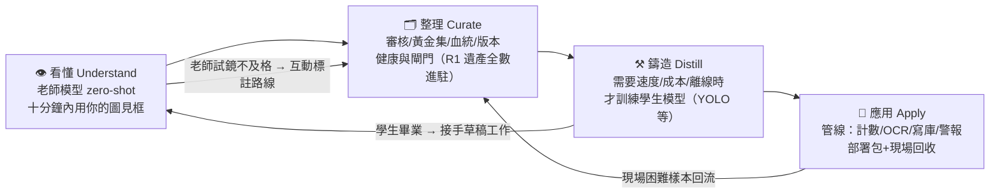

# GoodYolo 第二輪架構評審報告（Architecture Challenge R2）

> **🟩 文件狀態：定案・已採納** — 本評審之結論已由《VisionForge Constitution v1.0》確認並部分入憲；第 10.6 節新骨架（看懂→整理→鑄造→應用、M0–M3 分期）為 R3 與開發之基準。注意：問題七「Copilot 是核心之一」之表述已被憲法附錄第 8 條釐清（核心體驗，非核心架構）。

| 項目 | 內容 |
|---|---|
| 文件版本 | R2 v1.0 |
| 日期 | 2026-07-07 |
| 性質 | 架構評審（Architecture Review），非產品規劃 |
| 受審對象 | 《GoodYolo_產品規劃書.md》（R1，維持原狀不修改） |
| 評審立場 | 模擬多方視角的設計審查：Vision 模型廠商、Roboflow、CVAT、Ultralytics、Label Studio、CV 研究者、AI Agent 設計者、桌面應用架構師 |

**利益聲明**：R1 文件的作者就是本次評審的執筆者。以下內容包含對 R1 的自我批判，若批判不夠狠，等於評審失職。

---

## 目錄

- [第 0 章　總判決](#第-0-章總判決)
- [評審桌上的重話（各視角一句）](#評審桌上的重話各視角一句)
- [問題一　名字是否限制了整個產品](#問題一名字是否限制了整個產品)
- [問題二　大模型能否直接建立 Dataset](#問題二大模型能否直接建立-dataset)
- [問題三　AI Project Assistant 是否應該存在](#問題三ai-project-assistant-是否應該存在)
- [問題四　是否應該重新設計為 Visual AI IDE](#問題四是否應該重新設計為-visual-ai-ide)
- [問題五　API 成本下降後還需要大量人工標註嗎](#問題五api-成本下降後還需要大量人工標註嗎)
- [問題六　Vision Provider Plugin 是否值得](#問題六vision-provider-plugin-是否值得)
- [問題七　AI Copilot 是否應該成為產品核心](#問題七ai-copilot-是否應該成為產品核心)
- [問題八　站在 2030 年回望](#問題八站在-2030-年回望)
- [第 9 章　評審追加的缺陷（你沒問的）](#第-9-章評審追加的缺陷你沒問的)
- [第 10 章　最終六問](#第-10-章最終六問)

---

# 第 0 章　總判決

## 0.1 最大缺陷，一句話

> **GoodYolo 最大的缺陷不是任何一個功能，而是一個過時的前提：它假設「價值誕生在訓練之後」。**
>
> R1 的整條生產線是：先苦標幾百張 → 再訓練幾小時 → 然後才第一次看到自己的模型框出東西。這是 2020 年的世界。2026 年的現實是：SAM 3 用一句文字提示就能框出圖中每一個目標實例；Grounding DINO → 蒸餾 → YOLO 的流程（autodistill）2023 年就已開源成標準做法。**正確的順序是「先看懂、再變快」——理解在先（用大模型），訓練在後（為了速度、成本、離線才蒸餾成小模型）。** R1 把整個產品蓋在「新手從空白畫布手工標註」這塊地基上，而這塊地基正在融化。

## 0.2 判決摘要

| 判項 | 判決 |
|---|---|
| R1 賭「資料品質是核心資產」（血統/黃金集/閘門/盲審/版本化） | **賭對了，而且比 R1 自己以為的更對**——當所有標註都變成機器先標，治理機制從加分項變成命脈 |
| R1 賭「新手能獨自走完全程」（白話層/下一步引擎/TTFS） | **賭對了**——但「全程」的定義錯了，見下 |
| R1 的前提「工作流 = 手標 → 自訓 YOLO」 | **錯。這是產品身分層級的錯誤，不是功能層級** |
| R1 的前提「價值在訓練完成後才出現」 | **錯。範例專案是為這個錯誤前提打的補丁** |
| R1 的前提「Class = 封閉的類別清單」 | **錯。開放詞彙模型已把類別變成文字** |
| R1 的終點「匯出 = 產品結束」 | **錯。使用者的工作在偵測之後才開始（讀值、計數、寫庫、警報）** |
| 是否「根本走錯方向」 | **半錯。護城河選對了（資料品質工程＋新手體驗），地基選錯了（價值誕生點與產品身分）。現在換地基的成本是改一份文件；v1 出貨後再換，成本是重寫產品加重塑用戶認知。** |

---

# 評審桌上的重話（各視角一句）

**Roboflow 架構師**：「你們把 Auto Label 排在 v2，我們 2023 年就開源 autodistill 了——用基礎模型標註、蒸餾成 YOLO 部署，這在業界已是入門流程。R1 的 v1 工作流在出生之前就過時了。」

**CVAT 核心開發者**：「標註中心整章在優化 W 鍵手繪快捷鍵、方向鍵微調 1px——沒有一個字提到『點一下自動生框』。SAM 系列出來三年了。你們在優化馬車的懸吊系統。」

**Ultralytics 工程師**：「Engine Adapter 設計得不錯，但你們只抽象了『可以被訓練的模型』，沒有抽象『可以看圖的模型』。前者是引擎，後者才是視覺能力的全集。」

**CV 研究者**：「人類標註的錯誤是隨機的，老師模型的錯誤是**系統性且相關的**——整個資料集在同一個地方一起錯，這對下游訓練的毒性比隨機錯高一個量級。你們的盲審抽樣抓得到人的疲勞，抓不到老師的盲點。多老師交叉檢核是必需品，R1 把它列為 v2 選配。」

**Label Studio 設計師**：「聚類網格審核那幾頁是全文件最有價值的部分——因為在未來，**所有標註工作都是審核工作**。你們設計對了刀，卻把它排在錯的位置。」

**桌面應用架構師**：「『首次啟動下載 GB 級 Runtime』——很多工廠的產線電腦根本沒有對外網路。你們把最難的工程問題寫成了一個精靈的名字。」

**AI Agent 設計師**：「下一步引擎和建議引擎就是一個 Agent 的確定性雛形，你們自己沒發現。把它接上 LLM 和工具呼叫，Learning Center 一半的存在理由就消失了。」

**Vision 模型廠商視角**：「別把我們當威脅，把我們當老師。你們的護城河從來不是模型——是使用者親手校準過的黃金集、血統帳本和領域類別定義。那是我們拿不走的東西。」

---

# 問題一　名字是否限制了整個產品

## 1.1 判決：是，而且問題比名字深一層

名字只是症狀。真正的病灶是**產品身分**：R1 從第一章到最後一章，把「訓練出一顆自己的 YOLO」當成產品的存在理由。這個身分在三個層面同時過時：

**技術壽命層**。YOLO 是一個模型家族的商標式名稱，不是一種能力。家族會過氣：DETR 系（RT-DETR、D-FINE、DEIM）在精度上已經超車且授權更友善；更根本的是，開放詞彙模型（Grounding DINO、YOLO-World、OWLv2、SAM 3）正在改變「偵測」這個任務的定義——從「認得訓練過的 N 類」變成「你說什麼我找什麼」。把產品命名綁在其中一個家族上，等於把船焊死在一座正在移動的碼頭。

**心智定位層**。名字決定使用者拿什麼問題來找你。叫 GoodYolo，使用者的心智模型是「訓練 YOLO 的工具」；當他的問題其實不需要訓練就能解決（越來越常見），這個產品不在他的選項裡。反過來，當 YOLO 這個詞本身退流行，產品連同名字一起顯得陳舊——工具可以老，工具的名字不能先老。

**文件滲透層**。R1 嘴上說「引擎轉接層隔離演進」，但 YOLO 假設滲透在轉接層保護不到的地方：資料格式預設 YOLO txt、Class 是封閉的整數 ID 清單、評估圍繞固定類別的 mAP、匯出中心的心智模型是「一顆偵測器權重」。Adapter 保護了程式碼，沒有保護概念模型。

## 1.2 需要整個重寫嗎？

不需要重寫，需要**降格與升格**：把 YOLO 從「產品身分」降格為「其中一個可訓練的學生模型」；把「Universal Vision Workbench」從口號升格為真實的資訊架構（見問題六的 Provider 抽象與第 10.6 節的重新設計）。在今天做這件事，改的是一份 Markdown；在 v1 出貨、教學影片拍完、使用者社群叫慣了 GoodYolo 之後做，改的是產品加品牌加認知。**名字問題是本次評審所有問題中，修正成本隨時間增長最快的一個。**

新名字的具體提案見第 10.5 節。

---

# 問題二　大模型能否直接建立 Dataset

## 2.1 逐項能力盤點（2026 年的誠實評分）

你列的每一項，逐項給出成熟度與限制：

| 能力 | 2026 成熟度 | 工具現況 | 誠實的限制 |
|---|---|---|---|
| 自動理解圖片 | ●●●●○ | 任一 VLM（GPT/Gemini/Claude/Qwen-VL） | 描述性理解強；精確計數、微小目標仍不穩 |
| 自動建立 Class | ●●●○○ | VLM 掃描樣本 → 提議類別清單 | 提議品質好，但**領域粒度**要人裁決（「瑕疵」該分 3 類還是 7 類，是業務決策不是視覺問題） |
| 自動畫框 | ●●●●○ | Grounding DINO、SAM 3（文字提示 → 全實例框+mask）、OWLv2 | 常見物體近乎可用；**領域特化目標（PCB 瑕疵、CAD 符號）會失靈**；小目標、密集場景精度掉 |
| 自動分類 | ●●●●○ | VLM / CLIP 系 zero-shot | 細粒度類別（近似瑕疵型態）易混 |
| 自動產生 YOLO Label | ●●●●● | autodistill 已流程化：提示 → 標註 → 直接訓練 | 格式轉換是 solved problem，品質看上游 |
| 自動發現重複圖片 | ●●●●● | 影像 embedding（CLIP/DINOv2）+ 相似度 | 成熟可靠，R1 只用 pHash 是落後的 |
| 自動發現錯誤標註 | ●●●●○ | embedding 離群 + 老師模型重測交叉比對 | 抓「明顯錯」很準；抓「標準不一致」仍需人 |
| 自動產生 Dataset Report | ●●●●○ | 統計管線 + LLM 寫結論 | 數字要來自確定性管線，LLM 只負責敘事，否則幻覺 |

結論：**你的判斷正確——真正困難的是 Dataset，而大模型已經能承擔其中 60–80% 的粗工。** R1 把這些能力當成 v2 的錦上添花，是整份文件最大的排序錯誤。

## 2.2 架構應該怎麼變：三個翻轉

**翻轉一：標註中心 → 審核中心。** 預設工作流從「人畫框」變成「AI 先標、人修正」。人**永遠不該從空白畫布開始**——即使老師模型很爛，「修正爛草稿」通常也快於白手起家，而當老師夠好，人的工作就只剩品管。R1 花了整章優化手繪效率（W 鍵、微調、連續模式），這些變成備用手段；主手段是：文字提示批次預標 + 點擊生框（SAM 式互動）+ 聚類網格審核。值得說清楚：**R1 的五道防線（血統/黃金集/閘門/盲審）在這個翻轉後不是作廢，而是升格**——當 100% 的資料都是機器先標，防線就是產品的脊椎。

**翻轉二：Class Manager → 開放詞彙 Taxonomy。** 類別不再是 `0=螺絲, 1=螺帽` 的封閉整數清單，而是「文字描述 + 正反例圖 + 提示詞」的概念卡：同一張卡既是給人看的標註準則（R1 的類別定義卡，保留），也是給老師模型的 prompt，也是訓練學生模型時的類別映射。這一步讓資料模型天然支援「今天加一個新類別，先用 zero-shot 跑起來，之後再蒸餾」。R1 的類別定義卡設計意外地接近正解，但它被設計成「給人的文件」而不是「給模型的介面」。

**翻轉三：Embedding 升格為基礎設施。** 每張圖匯入即計算視覺向量，成為與 SHA-256 並列的一等公民。它同時支撐：近似重複（取代 pHash 為主力）、切分洩漏偵測、疑似錯標、主動學習排序、聚類審核、以及 R1 完全沒想到的**自然語言搜圖**（「找出所有生鏽的」）。R1 把 embedding 藏在健康檢查的實作細節裡，是把地基當裝潢。

## 2.3 誠實的邊界：老師會失靈的地方

對常見物體（人、車、動物、UI 按鈕），上述翻轉全面成立。但這個產品的目標場景包含 PCB 瑕疵、CAD 符號、工程圖——**這些正是 zero-shot 模型最弱的領域**（訓練語料裡沒有）。因此架構必須內建「**老師試鏡（Teacher Audition）**」機制：專案初期，使用者親手標 20–50 張（這正好就是黃金集的種子），系統用它測試每個可用 Provider 的命中率，**用數據決定**本專案走「草稿優先」還是「互動標註優先」路線，並持續監測。黃金集因此獲得第二個用途：不只裁決學生，也裁決老師。

這是對「全自動建 Dataset」最重要的修正：**能力是分領域的，架構必須先量測、再信任，而不是預設信任。**

---

# 問題三　AI Project Assistant 是否應該存在

## 3.1 判決：應該，但要分層——而且 R1 已經不自覺地做了一半

R1 的「下一步引擎」（狀態機查表）與「建議引擎」（症狀→藥方規則庫）就是一個 Agent 的**確定性內核**。這不是巧合，而是正確的分層直覺，只是 R1 沒有往上蓋第二層：

| 層 | 職責 | 特性 |
|---|---|---|
| 規則層（R1 已設計） | 下一步導引、健檢、已知症狀的藥方 | 即時、零成本、離線可用、永不幻覺 |
| Agent 層（R1 缺失） | 開放式診斷：「為什麼 Recall 低？」「哪些圖最值得重標？」跨資料源的因果推理 | 需要 LLM，讀取專案資料庫/訓練曲線/混淆矩陣/血統帳本後回答 |

正確關係是**規則層變成 Agent 的工具箱**：Agent 回答「為什麼 Recall 低」時，呼叫的是確定性管線（per-class FN 統計、目標尺寸分布、混淆對），然後把數字組織成診斷敘事並附上證據連結。**LLM 負責推理與表達，數字永遠來自確定性計算**——這條紀律不能破，因為對新手而言，一個自信的錯誤診斷比沒有診斷更毒。

## 3.2 比 Learning Center 更有價值嗎？

大部分是。Learning Center 的三個組件命運不同：hover 術語字典**保留**（零延遲、零成本、精確，聊天做不到這種即時性）；互動導覽**保留**（教操作不是教概念）;概念卡片庫**降格**——從「使用者主動去讀的內容」變成「Agent 回答時引用的教材」。使用者不會去讀「什麼是過擬合」，但會在 Agent 說「你的模型在背答案（這是過擬合，點此看 90 秒說明）」時點進去。**內容不死，入口死了。**

## 3.3 但有三個不可退讓的約束

一、**證據強制**：Agent 的每個結論必須附可點擊的證據（那 12 張混淆的圖、那條分岔的曲線），做不到 grounding 的回答寧可不答。二、**離線降級**：沒有 API key 或沒有網路時，規則層必須提供完整的基本體驗——Agent 是放大器，不是氧氣。三、**成本透明**：Agent 分析整個專案是要花 token 的，花費要像水電表一樣可見（見第 9 章成本帳本）。

---

# 問題四　是否應該重新設計為 Visual AI IDE

## 4.1 判決：反對以 Node Editor 為主介面——這是八個問題中唯一被評審團多數否決的提案

先說直覺為什麼誘人：ComfyUI 證明了節點圖的表達力，Cursor 證明了 AI 原生工具的想像空間，而「Dataset → Vision → OCR → LLM → SQLite 全部拖拉組合」聽起來就是未來。

然後說為什麼危險：**這個產品的第一公民是完全新手，而節點圖是對新手最殘忍的介面範式。** ComfyUI 對比 A1111/Forge 的歷史已經演過一遍：節點圖贏得了進階玩家，把新手嚇跑了。R1 全書最有價值的賭注是「小美不看文件能走完全程」——把主介面換成節點圖，等於親手撕毀這個賭注。Cursor 的類比也不成立：Cursor 的使用者是工程師，本產品的使用者是品管員。

## 4.2 但提案裡有兩塊真金，必須撿起來

**真金一：管線是對的資料模型。** 內部一切本來就該是 DAG——R1 的 Job 系統已經暗示了這件事。正確做法是「**圖為骨、精靈為皮**」：資料模型與執行引擎從第一天就是有向圖；UI 分層暴露——新手看到的是線性精靈（其實是圖上的一條預鋪路徑），進階者看到唯讀的管線視圖（理解資料怎麼流），專家在 v3 拿到可編輯的節點面板。**未來性放在資料模型裡，不是放在畫布上。** 這樣既不背叛新手，也不封死 ComfyUI 式的天花板。

**真金二：R1 的終點畫錯了。** 「Detect → OCR → LLM → SQLite」這條鏈戳中 R1 的真空地帶：R1 在「匯出 ONNX」就結束了，但使用者的真實任務**在偵測之後才開始**——框出儀表之後要讀值，框出瑕疵之後要記錄到資料庫、要發警報、要出日報。這叫**應用管線（Application Pipeline）**，它不是 Node IDE 的副產品，它本身就是被 R1 遺漏的產品階段（詳第 9.7 節與第 10.6 節）。少數幾個預組裝的應用範本（偵測→計數→寫檔；偵測→OCR→表格）對新手的價值，遠大於一張可以亂接的節點畫布。

## 4.3 結論

不要把產品重新設計成 IDE。把 DAG 埋進地基，把應用管線加進路線圖，把節點編輯器留給 v3 的專家層——**表達力應該是天花板，不是門檻。**

---

# 問題五　API 成本下降後還需要大量人工標註嗎

## 5.1 先把帳算清楚（2026 年的量級）

一張手機照片經 VLM 處理約消耗 2,400–6,600 tokens（依廠商的影像 token 化方式而異）；以 2026 年中階多模態模型的行情，**100 張圖的草稿標註成本落在數元到數十元台幣的量級**——你的估計正確。而本地開源老師（Grounding DINO、SAM 3、YOLO-World）成本趨近於電費。對照人工：一張中等密度的圖手標 30 秒–3 分鐘，5,000 張就是週級的人時。**純畫框的勞動，經濟上已經死亡。**

但你要求不只談價格。六個維度攤開：

| 維度 | 人工標註 | 雲端 API 草稿 | 本地開源老師草稿 |
|---|---|---|---|
| 直接成本 | 最高（人時） | 低且持續下降 | 趨近零（需 GPU） |
| 速度 | 週級 | 分鐘級（可平行） | 分鐘–小時級 |
| 領域覆蓋 | **全域**（人看得懂就標得了） | 常見物體強、**特化領域失靈** | 同左，且無法微調提示以外的行為 |
| 錯誤型態 | 隨機錯（疲勞、手滑） | **系統性錯**：同一盲點全資料集一起錯、錯得自信 | 同左 |
| 可重現性 | 低（人天天不一樣） | **低且不可控**：API 模型被廠商升級，去年的草稿今年重跑結果不同 | 高（模型檔在自己手上） |
| 隱私/合規 | 無風險 | **圖片出廠**——很多工業場景直接不可行 | 無風險 |

## 5.2 三個「不只是價格」的深層問題

**相關錯誤的毒性。** 人的錯是雜訊，訓練時會被平均掉一部分；老師的錯是**偏差**——每一張有陰影的焊點都被標成瑕疵，學生模型會把這個偏差學得又快又牢。因此草稿化時代的品管重點從「抓個別錯框」轉向「抓系統性偏差」：多老師交叉檢核（兩個 Provider 不一致 → 送人審）從 R1 的 v2 選配升為標準配備，黃金集作為與老師無關的獨立裁判變得更加不可替代。

**版本漂移與血統。** 用 API 標的資料，provenance 必須記到「Provider + 模型版本 + 提示詞」層級，否則兩年後你無法回答「這批標註是誰標的、還能不能重現」。R1 的血統設計（人工/模型 vX/修正）方向正確，但粒度要擴充到外部老師。

**能力邊界由量測決定。** 「還需不需要人工」不是意識形態問題，是每個專案的實測問題——這正是問題二提出的老師試鏡機制。常見物體：草稿優先，人只做品管；特化領域：互動輔助標註（SAM 點擊生框）優先，人仍是標準的定義者。

## 5.3 結論

你提的流程 **Vision API → AI Draft → Human Review → YOLO Training 是正確的新預設**，且應該從 v1 就是預設。但要修三個字：不是「不再需要人工」，而是人工的角色轉型——**從畫框的手，變成定義標準的腦（類別定義卡＋黃金集）、品管的眼（聚類審核＋抽查）、和仲裁的法官（老師們吵架時誰對）。** 大量人工標註死了；關鍵人工判斷比以前更值錢。產品該優化的不再是「畫框每張快 2 秒」，而是「審核每張快 5 秒」與「讓人只看最值得看的」。

---

# 問題六　Vision Provider Plugin 是否值得

## 6.1 判決：值得，而且這是本次評審唯一「全票通過」的提案——它是正確版本的 Engine Adapter

R1 的 Engine Adapter 抽象了「可以被訓練的模型」，這只涵蓋了視覺能力的一半。正確的抽象是：

> **Provider = 任何「輸入影像、輸出結構化理解」的東西。** 不管它是本地權重還是雲端 API，不管它要不要訓練，不管它背後是 CNN、Transformer 還是多模態 LLM。

在此之上做**師生二分**：

| 角色 | 定義 | 例子 | 在產品中的用途 |
|---|---|---|---|
| Teacher（老師） | 免訓練即可理解，貴或慢，不適合部署 | GPT/Gemini/Claude Vision、Qwen-VL、Grounding DINO、SAM 3、OWLv2 | 建 Class、打草稿、審資料、驗錯標、Playground 對照 |
| Student（學生） | 需要訓練，快而小，可部署到邊緣 | YOLO 系、RT-DETR、D-FINE | 蒸餾的目標、實際上線的工人 |

每個 Provider 附**能力聲明**：zero-shot？可訓練？可被什麼提示（文字/框/點擊/範例圖）？本地或雲端？成本模型？輸出可重現？支援哪些任務（框/mask/OCR/描述）？UI 依聲明動態組裝可用功能——這正是 R1 引擎能力聲明的放大版，設計手法可以直接沿用。

## 6.2 為什麼這不是過度設計

三個理由。**其一，它是唯一能同時容納問題二、五、七的地基**——AI 草稿、成本路由（便宜老師先跑、難圖升級貴老師）、Copilot 的視覺工具全部站在它上面。**其二，它是授權與商業風險的終極保險**——Ultralytics AGPL 問題、任一 API 廠商漲價或停服，都變成「換一個 Provider」而非「重寫產品」。**其三，它讓產品的敘事從「訓練工具」升級為「視覺能力的調度者」**，這是 2030 年還站得住的定位。

## 6.3 實作紀律（避免抽象災難）

警告一條反面路徑：第一天就設計九家 Provider 的完美介面 = 死於抽象。紀律是**先接三個、用到爛、再固化**：一個雲端 VLM（草稿+報告）、一個本地開放詞彙偵測器（Grounding DINO 或 SAM 3）、一個可訓練學生（Ultralytics）。介面的皺褶（VLM 回傳的框偏鬆、各家座標系與信心值語意不同、失敗模式各異）只有真實使用才會暴露——**輸出正規化與校準層**（把各家輸出翻譯成統一的內部格式，並用黃金集校準各家信心值）是這個抽象裡最難也最值錢的部分，不是介面定義本身。

---

# 問題七　AI Copilot 是否應該成為產品核心

## 7.1 判決：是「核心之一」，不是「唯一介面」——精確地說：GUI 是手，規則引擎是脊椎，Copilot 是顧問

先潑冷水：**「聊天作為主介面」對這類工具是陷阱。** 修正 400 個框、掃視聚類網格、拖曳門檻滑桿——這些高頻操作用聊的比用手慢十倍。凡是「看與改」的工作屬於 GUI，凡是「為什麼與接下來」的工作屬於 Copilot。你列的四個問題（Recall 為什麼低／哪些圖值得重標／該加什麼資料／是否過擬合）全部屬於後者，全部是 Copilot 的主場。

## 7.2 Copilot 的差異化不在聊天，在於它看得到你的專案

通用聊天機器人回答「Recall 低怎麼辦」只能給教科書答案。本產品的 Copilot 回答同一個問題時：讀取本專案的 per-class FN 統計 → 發現漏抓集中在小目標 → 調出目標尺寸分布證實 → 回答「你的 Recall 低主要來自『墊片』類的小目標漏抓（佔漏抓的 71%），這 24 張是證據 [點開]，建議提高輸入解析度並補拍近景」。**專案資料的 grounding 是 Copilot 唯一的存在理由**——做不到這一點，內建聊天視窗只是給產品裝了一個更貴的 FAQ。

進一步，Copilot 應該能**動手**（在確認後執行）：「把這 24 張加入審核佇列」「用上次的設定但解析度改 960 開一次草稿訓練」。這與問題三的 Agent 是同一個系統的兩個面：Agent 是能力，Copilot 是它的對話介面。

## 7.3 三條紅線

與問題三相同的紀律，再加一條：**產品在沒有 Copilot 時必須是完整的產品**（離線、無 API key、或使用者就是不想用）。Copilot 是全產品的顧問與加速器，但按鈕永遠在、規則引擎永遠在、報告永遠看得懂。把「必須連網呼叫 LLM」做成硬依賴的那一天，桌面工具的本分（可靠、私密、永遠打得開）就破產了。

---

# 問題八　站在 2030 年回望

## 8.1 一定會過時的設計

**手工從零標註作為預設流程**——2030 年回看會像今天回看手寫 HTML 表格一樣古老；審核與仲裁留下，繪製消失。**YOLO 作為產品身分**——模型家族的名字沒有一個活過十年，任務與資料才是常數。**封閉類別的資料模型**——開放詞彙將是預設，「類別」的本體是文字描述與範例，整數 ID 只是訓練學生模型時的臨時編碼。**手調超參數的 UI 面積**——自動配置已經解決 90%，剩下的交給 Agent 建議；R1 的專家參數面板會萎縮成除錯工具。**靜態教學內容作為主要教育手段**——被 grounded Copilot 取代，內容退居引用來源。**「一台電腦、一顆 GPU」的訓練假設**——訓練會越來越像「短租一陣雲上算力」，但**推論與部署恰恰相反**，會更往本地與邊緣走（隱私、延遲、成本）——R1 只押後者，方向對一半。

## 8.2 現在就不值得做的（R1 與本次提案中）

節點編輯器主介面（問題四已否決）、九家 Provider 大一統介面（先接三家）、訓練閘門的重訓版（統計閘門先行，R1 自己已標選配——維持）、多人協作、Plugin 市集、多 GPU——這些不是錯，是**現在做必然做錯**：需求還沒長出形狀。

## 8.3 現在沒想到、五年後一定需要的

1. **應用管線（Apply 階段）**：偵測之後的讀值/計數/寫庫/警報/報表。R1 最大的功能真空（第 9.7 節）。
2. **評估資產化（Eval-as-Asset）**：考卷比課本值錢。黃金集只是起點，2030 年的專業做法是維護「場景化考題庫」（逆光考卷/密集考卷/新產線考卷），每個模型過全套考試，像軟體的 CI 回歸測試。今天訓練資料可以外包給老師模型，**考題永遠不能外包**——這是使用者資產階梯的頂層。
3. **部署後回饋與漂移監測**：模型上線後產品不能失明。輕量方案：部署包內建「困難樣本回收」鉤子（低信心/使用者標記的現場圖回流審核佇列），儀表板顯示現場信心分布隨時間的漂移。R1 的回饋迴路只做到 Playground，差最後一哩。
4. **合成資料**：稀有類別（一年只出現三次的瑕疵）靠生成模型補齊將成常規武器。架構上它只是另一種 Data Source Provider——現在留介面，兩年後接實作。
5. **提示詞與類別定義的版本化**：當「類別=文字」，prompt 就是資產，要像資料集一樣有版本、有 diff、有回滾。
6. **成本帳本**：老師 API、雲訓練都是計量開銷，專案要有一頁「這個模型總共花了多少錢養成」——2030 年這會像今天的雲端帳單一樣理所當然。
7. **Agent 排程運維（桌面級 MLOps）**：「每週一自動用新回收的現場圖跑健檢，劣化就通知我並準備好重訓草案」——Agent 從回答問題進化到值班。

## 8.4 不會過時的（可以放心重壓的）

資料治理（血統/版本/黃金集/閘門）——AI 越自動，治理越值錢；審核的人因設計（聚類網格、盲審、蜜罐）——只要人還在迴路裡就有效；本地與邊緣部署需求；部署包與一致性驗證；以及「新手不看文件能走完」這條產品紀律本身。

---

# 第 9 章　評審追加的缺陷（你沒問的）

評審的職責是挑出委託人自己沒看到的問題。以下七條，按嚴重度排列。

## 9.1 【嚴重】標註中心整章在優化上一個時代的動作

R1 第 8 章精心設計了 W 鍵畫框、方向鍵 1px 微調、連續標註模式——卻**隻字未提互動式輔助標註**：點一下目標自動生框/mask（SAM 式）、框個大概自動吸附邊緣、文字提示批次預標。這些自 2023 年起就是 CVAT、Label Studio、X-AnyLabeling 的標配。R1 等於在 2026 年設計了一款沒有自動對焦的相機，然後把對焦環的手感打磨到極致。修法：審核中心（問題二翻轉一）以「提示與修正」為主動作，手繪降為 fallback；點擊生框在特化領域（老師失靈處）尤其重要——它不依賴老師認識你的類別，只依賴「物體性」，是 zero-shot 與純手工之間最實用的中間檔。

## 9.2 【嚴重】黃金集冷啟動的統計矛盾（R1 設計的內傷）

R1 防線一宣稱「T_high 用黃金集上的信心–精確率曲線逐類自動校準」。但 R1 又說黃金集初期每類約 20 張。**20 個樣本擬合出的 precision-confidence 曲線是統計噪音**——校準出的門檻可能比拍腦袋更危險，因為它披著「數據驅動」的外衣。修法：分級可信——樣本不足時退回保守的全域門檻並在 UI 明示「校準信賴度：低（黃金集樣本不足）」；門檻估計用全域先驗＋逐類收縮（shrinkage）而非逐類獨立擬合；黃金集達到門檻樣本量前，快速確認佇列強制縮窄。這條教訓要泛化：**凡是「自動校準」的機制，都必須聲明自己的信賴度，並在數據不足時知道要謙虛。**

## 9.3 【中】盲審稅沒有寫衰減函數

防線五的 5–10% 盲審抽樣，對單人使用者是實打實的稅：5,000 張資料集 = 250–500 張重複勞動。R1 沒有回答「這個稅率什麼時候可以降」。修法：信任自適應——盲審吻合率連續 N 批高於門檻，抽樣率階梯式下降（10% → 5% → 2% 地板值）；出現分歧立即回升。沒有衰減函數的品管機制，最終命運是被使用者整個關掉——**過度的防護等於沒有防護**。

## 9.4 【中】範例專案是止痛藥，不是解藥

R1 用內建範例專案解決「第一次成功太慢」，這是對「價值後置」病灶的補丁：因為用自己的資料要標一週、訓半天，所以先給你玩別人的資料。Zero-shot 草稿直接治本——**使用者匯入自己的圖，十分鐘內看到自己的目標被框出來**（老師模型即時預覽），信心建立在自己的問題上，而不是螺絲螺帽玩具上。範例專案降格為離線環境的備援教材。北極星指標同步修正：TTFS（首次成功）→ **TTFV（Time To First Value）：從安裝到「親眼看到自己的圖被正確理解」**，目標 10 分鐘——而且不需要等待任何訓練。

## 9.5 【中】離線與打包的難度被一個名字掩蓋了

「環境精靈」四個字底下埋著：GB 級 Runtime 的下載與斷點續傳、防毒軟體對 Python 執行檔的誤殺、公司代理與憑證、以及最被忽略的——**很多工業現場的電腦沒有對外網路**，「首次啟動下載」在目標客群的主戰場直接不成立。修法：提供「完整離線安裝檔」變體（體積大但自包含）為一等公民而非特例;Runtime 與 App 分離更新；把「無網環境全功能可用（除雲端老師外）」列為架構驗收條件。這也反向強化本地老師（Grounding DINO/SAM 3）不可或缺的地位——雲端 API 在這些場景根本進不了門。

## 9.6 【中】R1 的 MVP 對單人開發者過大，而新架構恰好給了解藥

R1 的 MVP 包含完整訓練管線、評估中心、匯出——對單人開發者 3–4 個月是樂觀估計。有趣的是，問題二的翻轉提供了更小的第一步：**M0 版可以完全沒有訓練功能**——匯入 → 老師草稿 → 審核 → 匯出乾淨資料集（YOLO/COCO 格式），這已經是一個自足且有人要的產品（市面上「本機、防呆、帶品管的資料集工房」本身就是空缺），且提前驗證了全產品最大的不確定性（審核 UX 與老師品質），而訓練管線是全產品**確定性最高**（Ultralytics 一行 API）、最不需要提前驗證的部分。把最確定的東西排最前面（R1 的做法）是工程直覺；把最不確定的東西排最前面（M0 的做法）才是產品直覺。

## 9.7 【嚴重・戰略級】產品在使用者的價值鏈中間就下車了

R1 的旅程終點是「匯出 ONNX + 部署包」。但小美的老闆不想要 ONNX，他想要「每天早上一張瑕疵統計報表」；阿宏不想要權重檔，他想要「遊戲裡的目標座標餵給他的腳本」。**偵測結果 → 業務價值之間的最後一哩（讀值/計數/入庫/警報/報表）被完全留白**，這正是問題四提案中最有價值的洞察（應用管線），也是五年後回看時 R1 最刺眼的空白。它不需要 Node IDE 才能做——三五個可設定的應用範本（監看資料夾 → 偵測 → 寫入 SQLite/CSV → 條件通知）就能覆蓋八成需求。

---

# 第 10 章　最終六問

## 10.1 哪些地方值得保留

以下經受住了本輪全部八個問題的攻擊，且多數在新架構下**更重要**：

1. **資料治理全家桶**：血統（擴充到記錄外部老師+版本+提示詞）、黃金集（新增老師試鏡職能）、入庫閘門、盲審+蜜罐（加上 9.3 的衰減函數）、Dataset 版本化與內容雜湊儲存。AI 標得越多，這套越是命脈。
2. **聚類網格審核 UX**——未來所有標註都是審核，這把刀直接成為主戰武器。
3. **白話翻譯層**：體檢報告、錯誤畫廊、門檻滑桿、判語式訓練監控。模型會換，人看不懂數字這件事不會換。
4. **確定性引導**：下一步引擎與建議引擎，降格為 Agent 的工具層後繼續服役，並兼任離線保底。
5. **工程地基**：專案自包含資料夾、Worker 程序隔離、事件匯流排、Job 系統、殼層可替換紀律。
6. **部署包＋匯出一致性驗證**、**誤判回饋迴路**（並延伸到部署後回收）。
7. **產品紀律本身**：新手不看文件走完全程、預設有主見、危險操作講人話。

## 10.2 哪些地方需要重做

1. **定位與資訊架構**：從「YOLO 訓練工具」改為「視覺能力工作台」，導航從「資料→標註→訓練→…」改為「看懂 → 整理 → 鑄造 → 應用」（見 10.6）。
2. **Engine Adapter → Vision Provider 抽象**（師生二分＋能力聲明＋輸出校準層）。
3. **標註中心 → 審核中心**：AI 草稿優先、點擊生框、提示批次預標；手繪降為備用。
4. **Class Manager → 開放詞彙 Taxonomy**（類別=文字描述+範例+提示詞，帶版本）。
5. **Learning Center → Copilot＋知識庫**：內容保留，入口重造；Copilot 以工具呼叫接管診斷問答。
6. **Roadmap 重排**：embedding 基礎設施與老師草稿從 v2 提到第一版；訓練管線從第一版後移（見 M0/M1）；健康檢查的重複偵測主力從 pHash 換成 embedding。
7. **北極星指標**：TTFS → TTFV（10 分鐘，用自己的資料，不等訓練）。

## 10.3 哪些地方完全錯誤

不修飾地列出：

1. **「價值誕生在訓練之後」的前提**——全文件的第一性錯誤，其餘錯誤多是它的衍生物。
2. **手工標註為 v1 預設、Auto Label 排 v2**——順序整個顛倒。正確世界裡「auto」不是 label 的形容詞，而是 label 的預設形態。
3. **Class = 封閉整數 ID 的資料模型**——它讓開放詞彙、文字搜圖、prompt 資產全部無處安放；這是 Schema 級錯誤，晚改一天多痛一天。
4. **產品終點設在匯出**——使用者的價值鏈走到一半就把人放下車。
5. **名字**——GoodYolo 把一個模型家族的名字焊在船身上。

## 10.4 哪些地方未來五年一定會淘汰

濃縮為一張表：

| R1 中的設計 | 淘汰原因 | 遺產 |
|---|---|---|
| 手繪標註為主的標註中心 | 草稿+審核成為預設 | 快捷鍵與畫布引擎轉入「修正」場景 |
| YOLO 命名與身分 | 模型家族必然輪替 | 任務抽象與 Provider 架構 |
| 封閉類別清單 | 開放詞彙成為預設 | 類別定義卡進化為概念卡 |
| 概念卡片式 Learning Center 入口 | grounded Copilot 接管問答 | 內容成為 Copilot 的引用庫 |
| 大面積手調參數面板 | 自動配置+Agent 建議 | 收縮為專家除錯工具 |
| 單機訓練假設 | 訓練走向短租雲算力 | 本地推論與部署反而更興盛 |
| pHash 為主的重複偵測 | embedding 全面接管 | 保留為零成本第一道濾網 |

## 10.5 重新命名

命名原則：命名「工作」而不是「技術」；五年後不尷尬；中英文都站得住；為 Segmentation/OCR/VLM/管線留空間。

**主提案：VisionForge（中文：視界工坊）。** Forge（鍛造坊）精準對應產品的新敘事——大模型是老師，資料是礦石，鍛造出屬於你的、可部署的視覺能力；「Workbench（工作台）」的樸實感也被保留。動詞性強：「把它 forge 成一顆邊緣模型」。

備選：**Argus**（希臘神話百眼巨人，永不闔眼的看守者——氣質極合，但同名開源專案多，商標要查）；**Percept**（感知，冷靜專業）；**Vantage**（制高點/視角，商務感強）。反例提醒：任何含 YOLO、DETR、SAM 的名字都重蹈覆轍；任何含 AI 的名字五年後都像今天名字裡的「2000」。

倉庫代號續用 GoodYolo 無妨——產品名是給使用者的承諾，代號只是路徑。

## 10.6 如果今天重新開始設計

新的一句話定位：

> **把大模型的理解力，鑄造成你自己的視覺能力。**
> 先讓它看懂（老師模型，十分鐘見效），再讓它變快（蒸餾成小模型，需要時才做），最後讓它上工（應用管線，接進你的業務）。

### 新的核心迴圈（取代 R1 的線性生產線）

三個關鍵差異：**（1）訓練從「目的」降為「手段」**——只在明確需要（邊緣部署、速度、離線、成本）時進入鑄造站，且產品會告訴你「老師直接上就夠了」的情況；**（2）價值在第一站就出現**——TTFV 10 分鐘，用使用者自己的圖；**（3）迴圈閉合到現場**——Apply 站回收的困難樣本流回 Curate，這才是「用很多年」的產品該有的代謝系統。

### 新的分期

| 版本 | 內容 | 驗證什麼 |
|---|---|---|
| **M0 資料工房**（最小可出貨） | 匯入＋embedding 基礎設施、老師草稿（1 雲端 VLM＋1 本地開放詞彙模型）、老師試鏡、審核中心（聚類網格＋點擊生框）、黃金集、血統、版本化、資料集匯出 | 全產品最不確定的兩件事：審核 UX 與老師品質。**沒有訓練功能，但已是自足產品** |
| **M1 鑄造廠** | 訓練（三檔預設）、體檢報告、Playground、ONNX＋部署包 | R1 的訓練/評估遺產平移進來，確定性高 |
| **M2 品質引擎** | 閘門、盲審（含衰減）、健康 12 項、錯誤畫廊、A/B、Copilot v1（grounded 診斷） | 資料飛輪轉不轉得動 |
| **M3 平台** | 應用管線範本、Provider 對外 API、Segmentation/Pose（任務 Plugin）、現場回收、雲訓練橋接 | 天花板 |

### R1 沒有白寫

最後一句公道話：R1 約六成內容在新架構下直接平移——治理機制、審核 UX、白話層、工程地基、部署包、風險分析。本輪推翻的是**骨架與順序**，不是血肉。這正是「先寫規劃、再開評審」流程的價值：換地基的成本，現在只是兩份文件的 diff。

---

## 結語

R1 是一份「把 2022 年的工作流打磨到完美」的優秀文件——這正是它的問題。工具的宿命是：**你優化什麼，就會被什麼的消失所背叛。** 手工標註正在消失，自訓模型正在變成選配，而「讓機器看懂我的東西」這個需求會活得比所有模型家族都久。把產品錨在需求上，把模型（不管老師還是學生）全部關進 Provider 的籠子裡，把資料治理當作唯一不可外包的資產——這是評審團給出的、唯一一條 2030 年還走得通的路。

*本文件為評審意見，不修改 R1 原文。若採納，建議下一步：以 10.6 的新骨架起草 R3 版規劃書，R1 中被保留的章節（7、8 之審核部分、9、11、13）可大幅沿用。*

